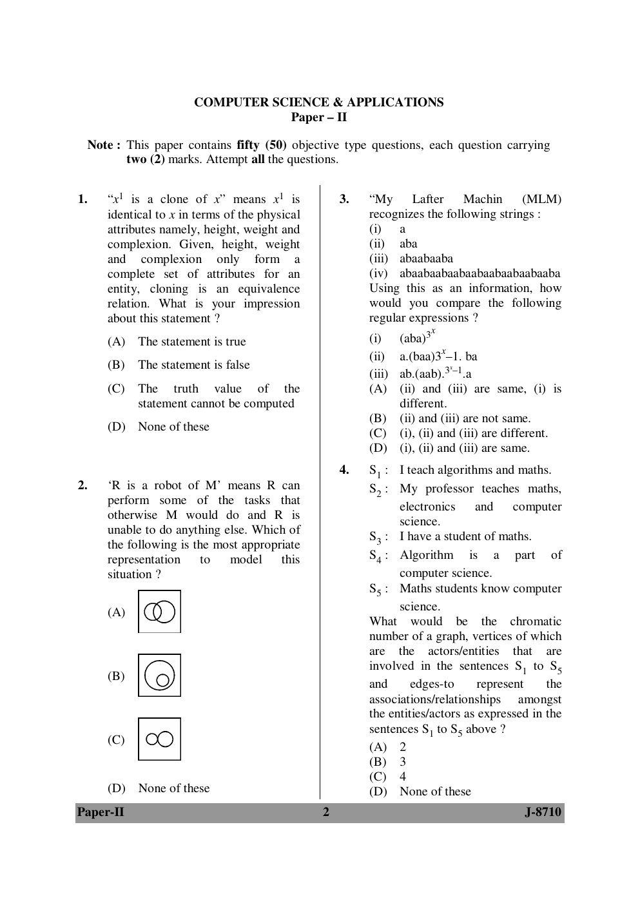

# Question 2

*UGC NET CS · 2010 June Paper 2 · Sets and Relations · Representation and Properties of Relations*

'R is a robot of M' means R can perform some of the tasks that M would otherwise do, and R is unable to do anything else. Which illustrated representation most appropriately models this situation?

- **1.** Diagram A (overlapping sets)
- **2.** Diagram B (one set contained in the other)
- **3.** Diagram C (externally connected sets)
- **4.** None of these

> [!TIP]
> **Correct answer: 2. Diagram B (one set contained in the other)**

## Solution

R can do only tasks that M can do, but it can do merely some of them. Thus Task(R) is a proper subset of Task(M). The correct set diagram is the small circle completely contained in the larger circle, shown in Diagram B.

## Key Points

- 'Some of M's tasks and no others' translates to R⊂M.

## Why the other options are incorrect

Overlap in Diagram A allows R-only tasks, contradicting 'unable to do anything else.' External contact in Diagram C does not express task inclusion.

## Question Figure

