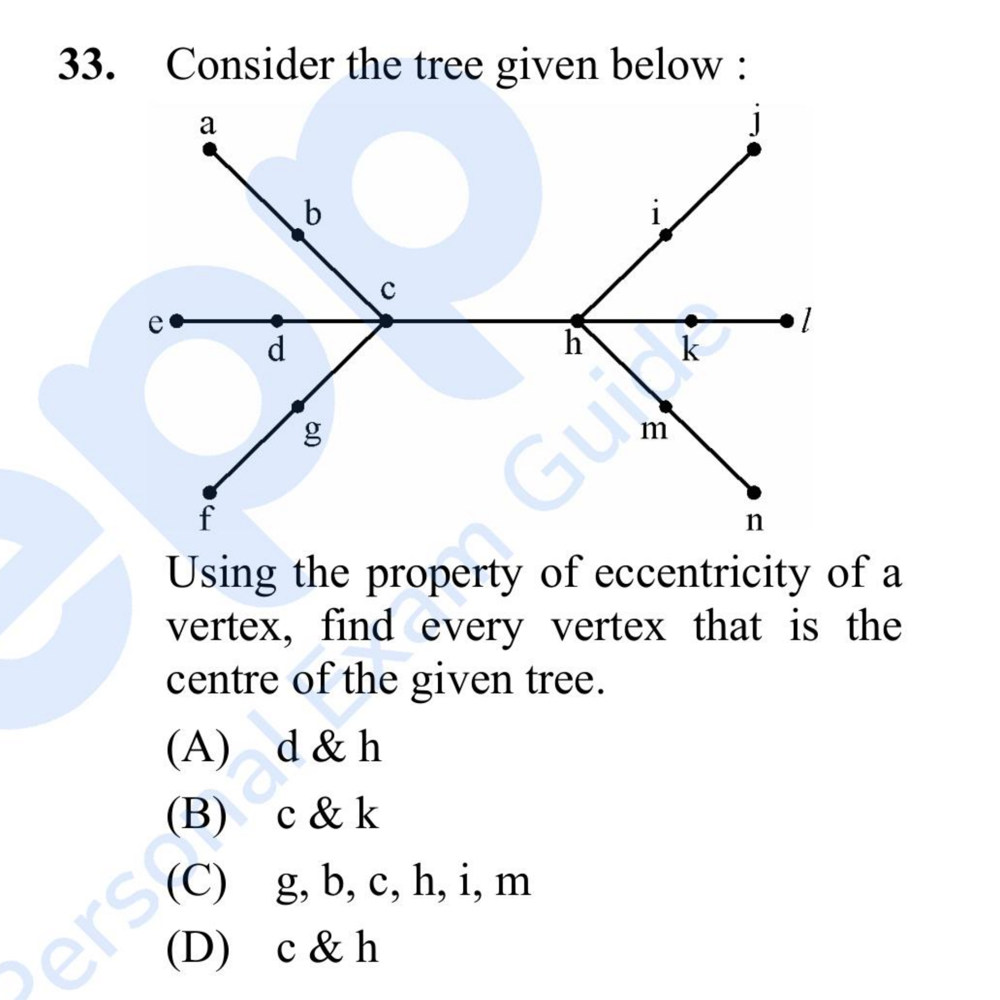

# Question 33

*UGC NET CS · 2012 Dec Paper 2 · Graph Theory · Tree Centers and Eccentricity*

For the tree shown in the figure, use vertex eccentricity to find every vertex that is a center of the tree.

- **1.** d and h
- **2.** c and k
- **3.** g, b, c, h, i, and m
- **4.** c and h

> [!TIP]
> **Correct answer: 4. c and h**

## Solution

The center of a tree consists of the vertex or adjacent pair with minimum eccentricity, equivalently the middle of every diameter. Any path from a left leaf such as a to a right leaf such as j has 5 edges: a-b-c-h-i-j. Its two middle vertices are c and h. Each has maximum distance 3 to a leaf, while moving one step away raises the maximum distance to at least 4. Thus both c and h, and only those two, are centers.

## Key Points

- Find a longest leaf-to-leaf path; the middle vertex or middle adjacent pair is the tree center.
- A 5-edge diameter has two centers.

## Why the other options are incorrect

d is farther than c from all right-side leaves, and k is farther than h from all left-side leaves. The six intermediate branch vertices do not share minimum eccentricity. The tree has an odd-diameter length in edges, so its center is an adjacent pair rather than a single vertex.

## Question Figure

