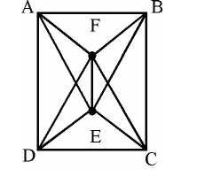

# Question 3

*UGC NET CS · 2014 Dec Paper 2 · Graph Theory · Complete Bipartite Graph and Hamiltonian Cycle*

Consider the Graph shown below : This graph is a __________.

- **A.** Complete Graph
- **B.** Bipartite Graph
- **C.** Hamiltonian Graph
- **D.** All of the above

> [!TIP]
> **Correct answer: Both B and C are correct; the question has no unique correct option. The graph is K₃,₃, which is bipartite and Hamiltonian but not complete.**

## Solution

The vertices split into {A,C,F} and {B,D,E}, with every edge joining the two sets and all nine cross-set edges present. Thus the graph is the complete bipartite graph K₃,₃, so B is true. It also has a Hamiltonian cycle, for example A–B–C–D–F–E–A, so C is true. It is not the complete graph K₆ because same-part pairs such as A–C are not adjacent.

## Key Points

- K₃,₃ is bipartite by definition and contains a six-vertex alternating cycle, so it is Hamiltonian too.

## Why the other options are incorrect

A is false because a complete six-vertex graph would contain every pairwise edge and have 15 edges, not 9. D is false because 'all' includes A. Since B and C are separately true, the MCQ is defective rather than having one valid label.

## Question Figure

