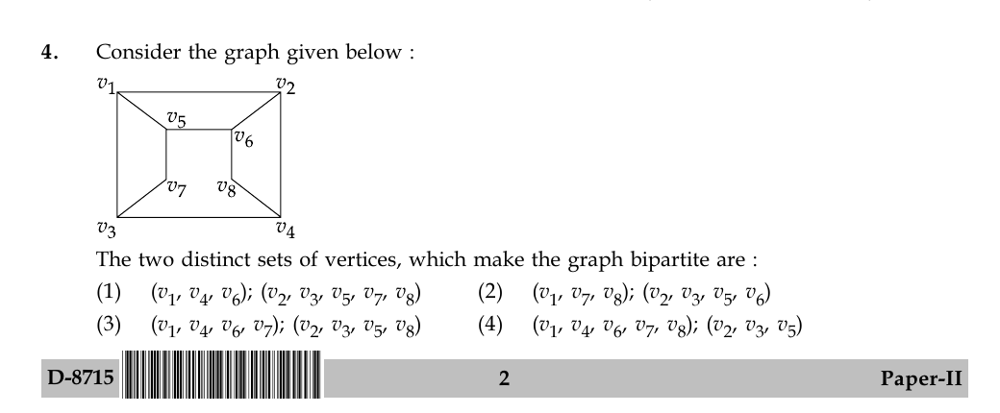

# Question 4

*UGC NET CS · 2015 Dec Paper 2 · Graph Theory · Bipartite Graphs*

Consider the graph given below : The two distinct sets of vertices, which make the graph bipartite are :

- **1.** (v1, v4, v6); (v2, v3, v5, v7, v8)
- **2.** (v1, v7, v8); (v2, v3, v5, v6)
- **3.** (v1, v4, v6, v7); (v2, v3, v5, v8)
- **4.** (v1, v4, v6, v7, v8); (v2, v3, v5)

> [!TIP]
> **Correct answer: 3. (v1, v4, v6, v7); (v2, v3, v5, v8)**

## Solution

Two-color the graph starting with v1 in set A. Its neighbors v2, v3, and v5 must be in set B. From those vertices, v4, v6, and v7 must be in A. Finally v8, adjacent to v4 and v6, belongs to B. Thus A={v1,v4,v6,v7} and B={v2,v3,v5,v8}, exactly option 3. Every displayed edge crosses between A and B.

## Key Points

- A bipartition is obtained by alternating colors along edges; no edge may have both endpoints in one set.

## Why the other options are incorrect

Option 1 omits v7 from its first set; option 2 places adjacent vertices v6 and v5 in the same set and also fails to place all eight vertices; option 4 places adjacent vertices v6 and v7 with v1 while leaving v8 on that side, so its proposed coloring is inconsistent.

## Question Figure

