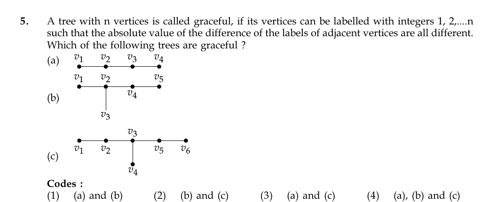

# Question 5

*UGC NET CS · 2015 Dec Paper 2 · Graph Theory · Graceful Labeling of Trees*

A tree with n vertices is called graceful if its vertices can be labelled with the integers 1, 2, ..., n so that the absolute differences between the labels of adjacent vertices are all distinct. Which of the displayed trees are graceful?

- **1.** (a) and (b)
- **2.** (b) and (c)
- **3.** (a) and (c)
- **4.** (a), (b) and (c)

> [!TIP]
> **Correct answer: 4. (a), (b) and (c)**

## Solution

A tree on n vertices is graceful when the n−1 edge differences are exactly 1,…,n−1. Explicit labelings prove all three cases. For (a), assign (v1,v2,v3,v4)=(1,4,2,3), producing differences 3,2,1. For (b), assign (v1,v2,v3,v4,v5)=(1,5,2,3,4), producing differences 4,3,2,1 on edges v1v2, v2v3, v2v4, v4v5. For (c), assign (v1,v2,v3,v4,v5,v6)=(1,6,2,5,4,3); its five edge differences are 5,4,3,2,1. Therefore (a), (b), and (c) are all graceful.

## Key Points

- To prove a small tree graceful, exhibit distinct vertex labels 1…n whose edge differences cover 1…n−1 once each.

## Why the other options are incorrect

Options 1–3 each omit at least one tree for which the displayed explicit labeling satisfies the definition. A single valid labeling is enough to prove that a tree is graceful.

## Question Figure

