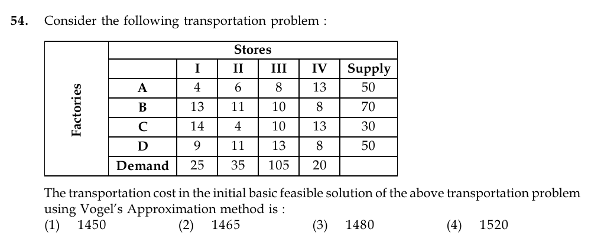

# Question 54

*UGC NET CS · 2015 Dec Paper 3 · Optimization · Vogel's Approximation Method*

For the displayed transportation table, what is the transportation cost of the initial basic feasible solution obtained by Vogel's Approximation Method (VAM)?

- **1.** 1450
- **2.** 1465
- **3.** 1480
- **4.** 1520

> [!TIP]
> **Correct answer: 2. 1465**

## Solution

Total supply is 200, while displayed demand is 185, so first add a dummy destination with demand 15 and zero cost from every factory. Applying VAM gives these allocations: D→dummy=15, C→II=30, A→I=25, A→II=5, A→III=20, D→IV=20, D→III=15, and B→III=70. The cost is 15·0 + 30·4 + 25·4 + 5·6 + 20·8 + 20·8 + 15·13 + 70·10 = 0+120+100+30+160+160+195+700 = 1465. Thus option 2 is correct.

## Key Points

- Balance an unbalanced transportation problem with a zero-cost dummy row/column before computing VAM penalties.

## Why the other options are incorrect

The other totals do not follow from the VAM allocation. A common source of error is to start VAM on the unbalanced table or to assign a nonzero cost to the dummy destination; the dummy absorbs the 15-unit excess supply at zero transportation cost.

## Question Figure

