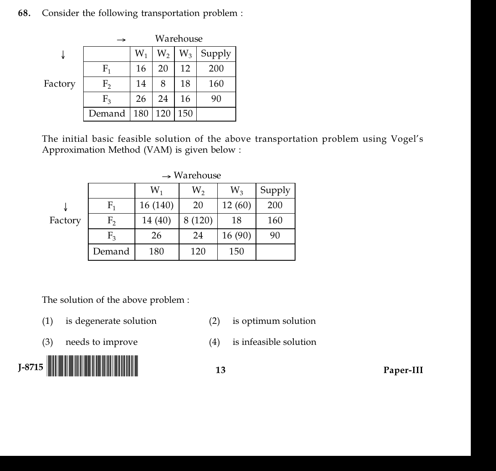

# Question 68

*UGC NET CS · 2015 June Paper 3 · Optimization · MODI Optimality Test for Transportation Problems*

Consider the following transportation problem : → Warehouse ↓ W1 W2 W3 Supply F1 16 20 12 200 Factory F2 14 8 18 160 F3 26 24 16 90 Demand 180 120 150 The initial basic feasible solution of the above transportation problem using Vogel’s Approximation Method (VAM) is given below : → Warehouse W1 W2 W3 Supply ↓ F1 16 (140) 20 12 (60) 200 Factory F2 14 (40) 8 (120) 18 160 F3 26 24 16 (90) 90 Demand 180 120 150 The solution of the above problem :

- **1.** is degenerate solution
- **2.** is optimum solution
- **3.** needs to improve
- **4.** is infeasible solution

> [!TIP]
> **Correct answer: 2. is optimum solution**

## Solution

The five positive allocations satisfy all supplies and demands, and `m+n−1 = 3+3−1 = 5`, so the basic solution is feasible and nondegenerate. Apply the MODI test. Set `u1=0`; occupied cells give `v1=16`, `v3=12`, `u2=−2`, `v2=10`, and `u3=4`. For unoccupied cells, reduced costs `c_ij−(u_i+v_j)` are: F1W2=10, F2W3=8, F3W1=6, and F3W2=10. All are nonnegative, so no entering cell can reduce this minimization cost; the solution is optimal.

## Key Points

- Transportation optimum: find u,v from occupied cells, then require every unoccupied reduced cost `c−u−v ≥ 0` for minimization.

## Why the other options are incorrect

It is not degenerate because it has exactly five independent occupied cells. It is feasible because every row supply and column demand balances. It does not need improvement because every reduced cost passes the optimality test.

## Question Figure

