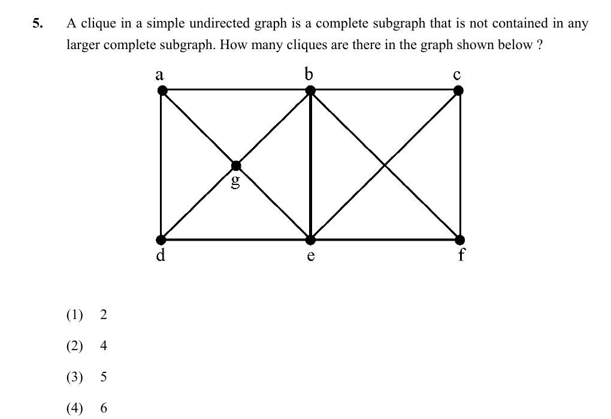

# Question 5

*UGC NET CS · 2016 July Paper 2 · Graph Theory · Maximal Cliques*

In this question, a clique means a complete subgraph not contained in any larger complete subgraph (a maximal clique). How many maximal cliques are in the displayed graph?

- **1.** 2
- **2.** 4
- **3.** 5
- **4.** 6

> [!TIP]
> **Correct answer: 3. 5**

## Solution

On the left, the center g and each adjacent perimeter edge form four maximal triangles: {a,b,g}, {b,e,g}, {d,e,g}, and {a,d,g}. On the right, b,c,e,f are mutually adjacent, so {b,c,e,f} is one maximal K₄. None of the four left triangles can be enlarged, and smaller complete subgraphs are contained in one of these five. Hence the graph has 4+1=5 maximal cliques.

## Key Points

- A maximal clique cannot be extended by another adjacent vertex; it need not be the graph's largest clique.

## Why the other options are incorrect

Counting only the right K₄ and some triangles undercounts. Counting individual edges or triangles inside the K₄ overcounts because the question defines a clique as maximal—any complete subgraph contained in a larger complete subgraph is excluded.

## Question Figure

