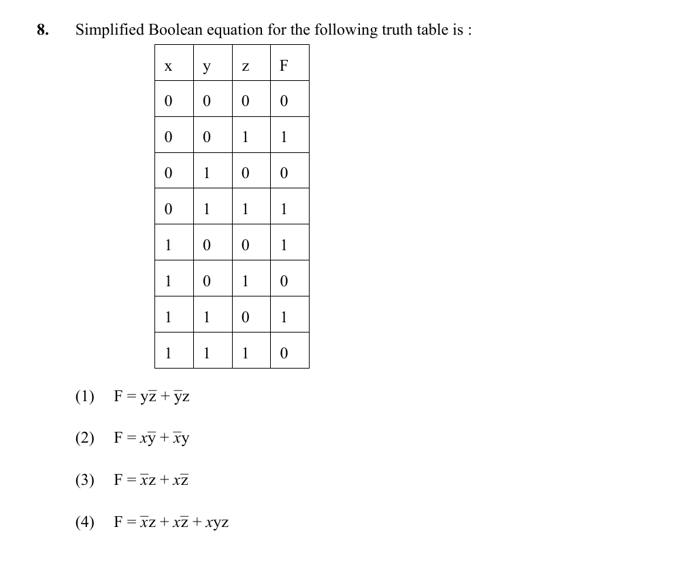

# Question 8

*UGC NET CS · 2016 July Paper 2 · Boolean Algebra · Truth-Table Simplification and XOR*

For the displayed truth table, which Boolean expression is the simplified form of F(x,y,z)?

- **1.** F = y z̄ + ȳ z
- **2.** F = x ȳ + x̄ y
- **3.** F = x̄ z + x z̄
- **4.** F = x̄ z + x z̄ + xyz

> [!TIP]
> **Correct answer: 3. F = x̄ z + x z̄**

## Solution

Read the table by fixing x and z. Whenever x=0, F equals z for both values of y; whenever x=1, F equals z̄ for both values of y. Thus y is irrelevant and F is 1 exactly when x and z differ: F=x⊕z=x̄z+xz̄. This is option 3.

## Key Points

- Look for an irrelevant variable by comparing truth-table rows that differ in only that variable.

## Why the other options are incorrect

Options 1 and 2 make F depend on y, contrary to pairs of rows that differ only in y but have the same output. Option 4 adds xyz, which would force F=1 at x=y=z=1, whereas the table gives F=0 there.

## Question Figure

