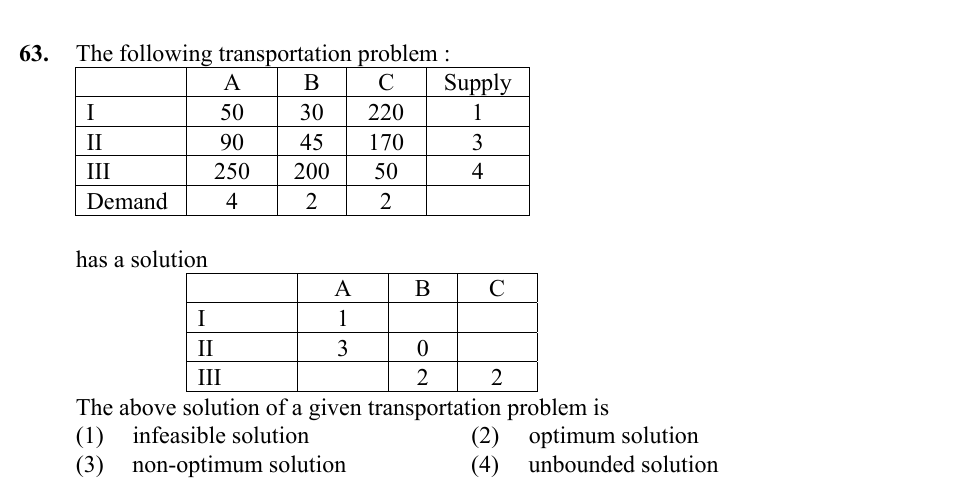

# Question 63

*UGC NET CS · 2016 July Paper 3 · Optimization · MODI Optimality Test for Transportation Problems*

The displayed transportation problem has the shown proposed allocation. The proposed solution is

- **1.** infeasible solution
- **2.** optimum solution
- **3.** non-optimum solution
- **4.** unbounded solution

> [!TIP]
> **Correct answer: 2. optimum solution**

## Solution

The allocation is feasible: row totals are 1, 3, and 4, matching the three supplies, while column totals are 4, 2, and 2, matching demands A, B, and C. To test optimality for this minimization problem, treat the displayed zero at (II,B) as a degenerate basic cell so there are m+n−1=5 basic cells. Set u_I=0 and solve u_i+v_j=c_ij on basic cells. This gives v_A=50, u_II=40, v_B=5, u_III=195, and v_C=−145. The nonbasic reduced costs c_ij−(u_i+v_j) are 25 at (I,B), 365 at (I,C), 275 at (II,C), and 5 at (III,A). All are nonnegative, so no transportation loop can reduce cost. The plan is optimal, option 2.

## Key Points

- For a minimization transportation problem, a feasible basic solution is optimal when every nonbasic reduced cost c_ij−(u_i+v_j) is nonnegative.

## Why the other options are incorrect

It is not infeasible because every supply and demand balance is satisfied. It is not non-optimal because the MODI reduced-cost test has no negative value. It cannot be called unbounded: the displayed balanced transportation model has finite supplies, demands, and cell costs.

## Question Figure

