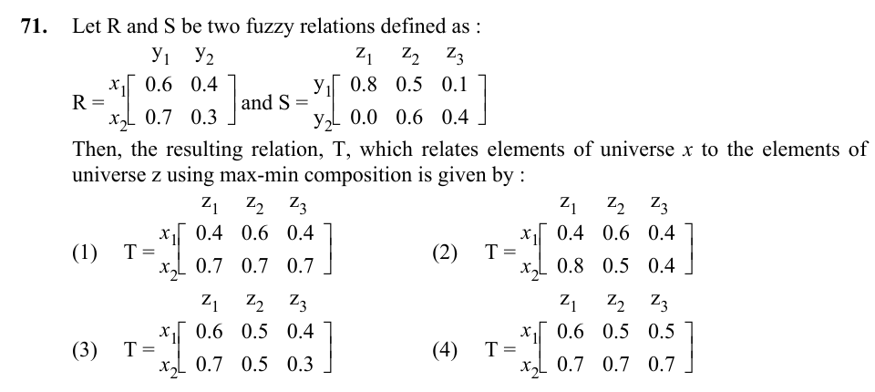

# Question 71

*UGC NET CS · 2017 Jan Paper 3 · Fuzzy Sets and Relations · Max-Min Composition of Fuzzy Relations*

Let R=[[0.6,0.4],[0.7,0.3]] relate X to Y and S=[[0.8,0.5,0.1],[0.0,0.6,0.4]] relate Y to Z. Which matrix is the max-min composition T=R∘S?

- **1.** [[0.4,0.6,0.4],[0.7,0.7,0.7]]
- **2.** [[0.4,0.6,0.4],[0.8,0.5,0.4]]
- **3.** [[0.6,0.5,0.4],[0.7,0.5,0.3]]
- **4.** [[0.6,0.5,0.5],[0.7,0.7,0.7]]

> [!TIP]
> **Correct answer: 3. [[0.6,0.5,0.4],[0.7,0.5,0.3]]**

## Solution

For max-min composition, T(i,k)=max_j min(R(i,j),S(j,k)). Row x1 gives: z1=max(min(.6,.8),min(.4,0))=.6; z2=max(.5,.4)=.5; z3=max(.1,.4)=.4. Row x2 gives: z1=max(.7,0)=.7; z2=max(.5,.3)=.5; z3=max(.1,.3)=.3. Hence T=[[.6,.5,.4],[.7,.5,.3]], which is option 3.

## Key Points

- Fuzzy relation composition replaces multiply-and-sum with min-and-max: pair by min, combine alternatives by max.

## Why the other options are incorrect

The other matrices use ordinary multiplication, choose the wrong min/max order, or carry values larger than the relevant pairwise minima. Each output cell must be calculated independently using max over the two intermediate y values.

## Question Figure

