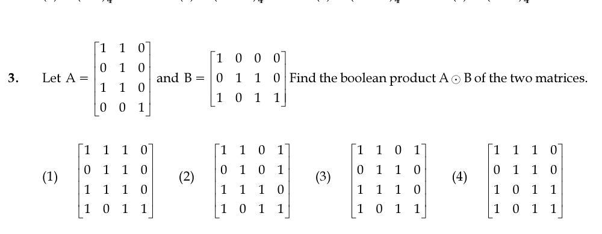

# Question 3

*UGC NET CS · 2017 Nov Paper 2 · Boolean Algebra · Boolean Matrix Multiplication*

Let A = [[1,1,0],[0,1,0],[1,1,0],[0,0,1]] and B = [[1,0,0,0],[0,1,1,0],[1,0,1,1]]. Find the Boolean product A ⊙ B.

- **1.** [[1,1,1,0],[0,1,1,0],[1,1,1,0],[1,0,1,1]]
- **2.** [[1,1,0,1],[0,1,0,1],[1,1,1,0],[1,0,1,1]]
- **3.** [[1,1,0,1],[0,1,1,0],[1,1,1,0],[1,0,1,1]]
- **4.** [[1,1,1,0],[0,1,1,0],[1,0,1,1],[1,0,1,1]]

> [!TIP]
> **Correct answer: 1. [[1,1,1,0],[0,1,1,0],[1,1,1,0],[1,0,1,1]]**

## Solution

In a Boolean product, entry (i,j) is the OR of the pairwise ANDs from row i of A and column j of B. The first row [1,1,0] therefore selects and ORs rows 1 and 2 of B, giving [1,1,1,0]. The second row [0,1,0] copies row 2 of B, giving [0,1,1,0]. The third row repeats the first result. The fourth row [0,0,1] copies row 3 of B, giving [1,0,1,1]. Hence A⊙B=[[1,1,1,0],[0,1,1,0],[1,1,1,0],[1,0,1,1]], which is option 1.

## Key Points

- Boolean matrix multiplication: cᵢⱼ = OR over k of (aᵢₖ AND bₖⱼ).

## Why the other options are incorrect

The other matrices change at least one row that follows immediately from the selector pattern in A. Ordinary arithmetic multiplication is also inappropriate: Boolean multiplication uses AND in place of multiplication and OR in place of addition.

## Question Figure

