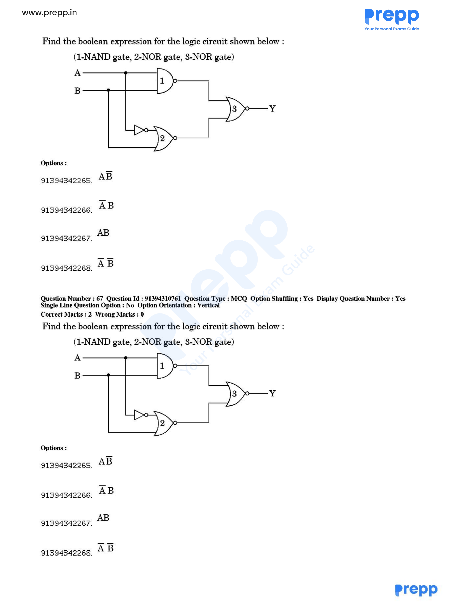

# Question 67

*UGC NET CS · 2018 Dec Paper 1 And 2 · Boolean Algebra · Multi-Level Gate Circuit Simplification*

Find the Boolean expression for the logic circuit shown (gate 1 is NAND; gates 2 and 3 are NOR).

- **1.** A AND (NOT B)
- **2.** (NOT A) AND B
- **3.** A AND B
- **4.** (NOT A) AND (NOT B)

> [!TIP]
> **Correct answer: 3. A AND B**

## Solution

Read the circuit one gate at a time. Gate 1 is NAND, so X=(AB)̅=A̅+B̅. The lower inverter produces A̅; gate 2 is NOR with inputs A̅ and B, so Z=(A̅+B)̅=AB̅. Gate 3 NORs X and Z: Y=(X+Z)̅=[(A̅+B̅)+AB̅]̅. The term AB̅ is already covered by B̅, leaving Y=(A̅+B̅)̅=AB. Hence option 3.

## Key Points

- Label each intermediate gate output, then simplify with De Morgan’s law and absorption before comparing options.

## Why the other options are incorrect

The other options result from missing an output bubble or applying De Morgan’s law to only one input. Every NAND/NOR output bubble negates the entire gate input expression.

## Question Figure

