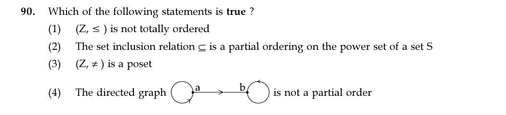

# Question 90

*UGC NET CS · 2018 July Paper 2 · Sets and Relations · Partial Orders and Relation Digraphs*

Which of the following statements is true ?

- **1.** (Z, ≤ ) is not totally ordered
- **2.** The set inclusion relation ⊆ is a partial ordering on the power set of a set S
- **3.** (Z, ≠ ) is a poset
- **4.** The directed graph is not a partial order

> [!TIP]
> **Correct answer: 2. The set inclusion relation ⊆ is a partial ordering on the power set of a set S**

## Solution

Set inclusion on P(S) is reflexive (A⊆A), antisymmetric (A⊆B and B⊆A imply A=B), and transitive (A⊆B⊆C implies A⊆C), so it is a partial order. Hence option 2 is true.

## Key Points

- Partial order = reflexive + antisymmetric + transitive; total order additionally compares every pair.

## Why the other options are incorrect

The integers under ≤ are totally ordered, so option 1 is false. `≠` is not reflexive, so option 3 is not a poset. The pictured relation contains (a,a), (b,b), and (a,b); it is reflexive, antisymmetric, and transitive, so the graph does represent a partial order and option 4's `not` makes it false.

## Question Figure

