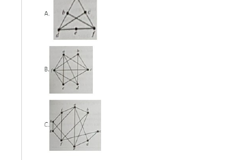

# Question 27

*UGC NET CS · 2021 Nov With Answers · Graph Theory · Planarity, K3,3 and the Petersen Graph*

Which of the three graphs A, B and C shown in the accompanying figure is/are planar?

- **1.** A and B only
- **2.** B and C only
- **3.** A only
- **4.** B only

> [!TIP]
> **Correct answer: 3. A only**

## Solution

Planarity concerns whether a graph can be redrawn without crossings, not whether its supplied drawing already has crossings. Graph A can be redrawn by routing its crossed chords around the outer cycle, so it is planar. Graph B is K3,3: its six vertices split into two groups of three with every cross-group pair adjacent, and Kuratowski's theorem makes it nonplanar. Graph C is the Petersen graph, another nonplanar graph; it has a K3,3 minor. Hence only A is planar, option 3.

## Key Points

- Identify graph structure, not drawing style: K3,3 and the Petersen graph are nonplanar; incidental crossings can disappear under redrawing.

## Why the other options are incorrect

Options 1 and 4 classify K3,3 as planar, while option 2 excludes the redrawable graph A and includes the two nonplanar graphs. A visible crossing alone is not proof of nonplanarity because edges can often be rerouted.

## Question Figure

