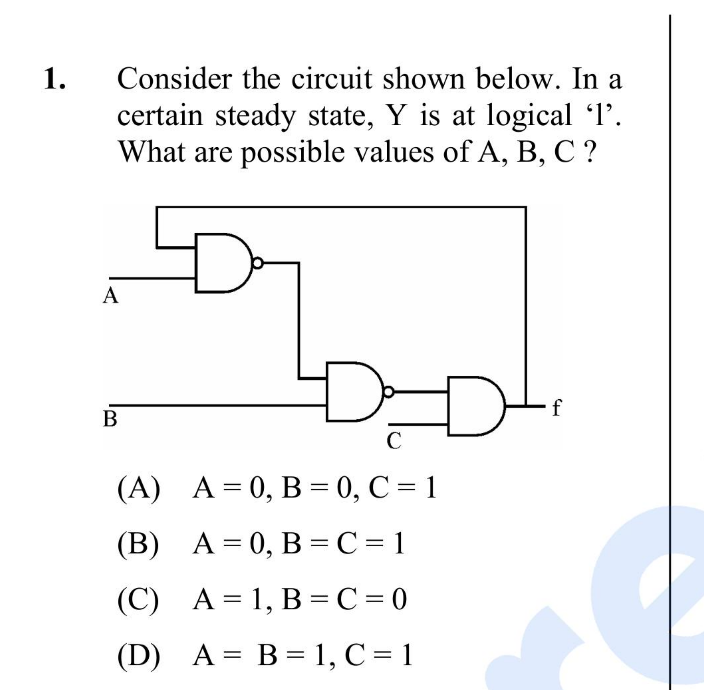

# Question 1

*UGC NET CS · 2012 Dec Paper 2 · Digital Logic Circuits and Components · Feedback Logic and Steady States*

Consider the circuit shown below. In a certain steady state, output f is at logical 1. What are the possible values of A, B and C?

- **A.** A=0, B=0, C=1
- **B.** A=0, B=C=1
- **C.** A=1, B=C=0
- **D.** A=B=1, C=1

> [!TIP]
> **Correct answer: Options A and D both satisfy the stated steady-state condition**

## Solution

Let x be the output of the first NAND gate and z the output of the second NAND gate. From the circuit, x = NOT(A AND f), z = NOT(x AND B), and f = z AND C. The question fixes f=1, so C must be 1 and z must be 1. With f=1, x=NOT A; therefore z=1 exactly when (NOT A) AND B is 0, or equivalently when A=1 or B=0. Option A has B=0 and C=1, so it works. Option D has A=1 and C=1, so it also works. Direct substitution confirms that both reproduce f=1.

## Key Points

- For feedback logic, write one Boolean equation per gate and require the assumed output to reproduce itself.
- Here f=1 implies C=1 and (A=1 or B=0).

## Why the other options are incorrect

B gives A=0 and B=1, hence x=1 and z=0, making f=0. C has C=0, so the final AND gate forces f=0. The printed item is defective because it offers both A and D as separate choices even though both are steady-state solutions. If an unstated initial condition f=0 is assumed, A reaches 1 whereas D can remain at 0; that extra assumption may explain keys that select only A, but it is not in the question.

## Question Figure

