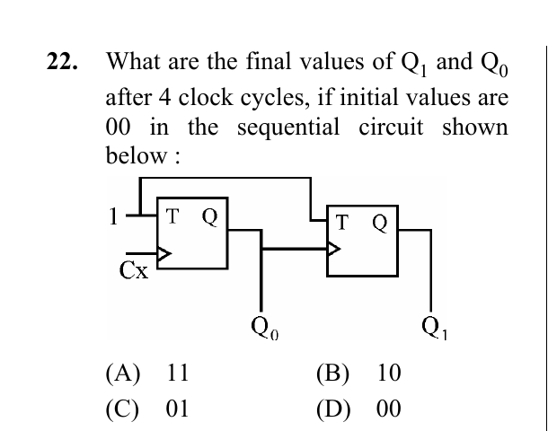

# Question 22

*UGC NET CS · 2013 Dec Paper 3 · Digital Logic Circuits and Components · Ripple T-Flip-Flop Counter*

What are the final values of Q 1 and Q0 after 4 clock cycles, if initial values are 00 in the sequential circuit shown below :

- **A.** 11
- **B.** 10
- **C.** 01
- **D.** 00

> [!TIP]
> **Correct answer: D. 00**

## Solution

Both T inputs are tied to 1, so each T flip-flop toggles on its active clock edge. Q0 toggles on every external clock. The second flip-flop is clocked by Q0 and toggles on each Q0 rising edge. Starting Q1Q0=00, the states after successive external clocks are 11, 10, 01 and 00. Thus after four cycles the state is 00.

## Key Points

- For a ripple counter, record which edge clocks each stage and trace the state one external clock at a time.

## Why the other options are incorrect

11, 10 and 01 are intermediate states after the first, second and third cycles. Counting only Q0 transitions or toggling Q1 on both edges produces the wrong sequence.

## Question Figure

