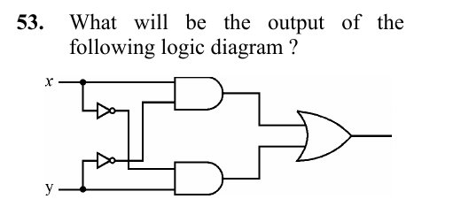

# Question 53

*UGC NET CS · 2013 Dec Paper 3 · Digital Logic Circuits and Components · XOR Realization with Basic Gates*

What will be the output of the following logic diagram ?

- **A.** x OR y
- **B.** x AND y
- **C.** x XOR y
- **D.** x XNOR y

> [!TIP]
> **Correct answer: C. x XOR y**

## Solution

Trace the two product terms in the diagram. The upper AND gate receives x and NOT y, producing x·y'. The lower AND gate receives NOT x and y, producing x'·y. The final OR gate therefore produces x·y' + x'·y. This expression is 1 exactly when the inputs differ, which is the XOR function.

## Key Points

- XOR's sum-of-products form is x·y' + x'·y: one input true and the other false.

## Why the other options are incorrect

OR is also 1 for x=y=1, but this circuit's two terms both become 0 there. AND is 1 only at 11. XNOR is 1 when the inputs are equal, the complement of the expression produced here.

## Question Figure

