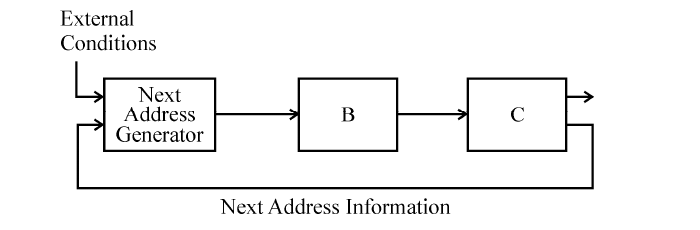

# Question 3

*UGC NET CS · 2017 Jan Paper 3 · Microprogrammed Control · Control Address Register and Control Memory*

The general configuration of the microprogrammed control unit is given below : What are blocks B and C in the diagram respectively ?

- **1.** Block address register and cache memory
- **2.** Control address register and control memory
- **3.** Branch register and cache memory
- **4.** Control address register and random access memory

> [!TIP]
> **Correct answer: 2. Control address register and control memory**

## Solution

The next-address generator computes the address of the next microinstruction from external conditions and the current microinstruction's next-address information. That address must first be latched in the control address register, which is block B. The register then selects a word from the control memory, block C; that word supplies control signals and feeds its sequencing information back to the next-address generator. Hence B and C are the control address register and control memory respectively.

## Key Points

- Microsequencer → control address register → control memory → control signals and next-address fields.

## Why the other options are incorrect

A cache is not the defining store in a microprogrammed control unit, and a branch register is not the normal register between the sequencer and control store. Although a writable control store can physically use RAM, the functional block is specifically called control memory, making option 2 more precise than option 4.

## Question Figure

