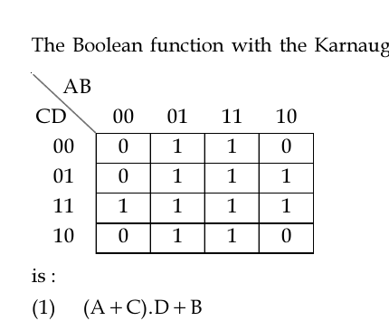

# Question 6

*UGC NET CS · 2017 Nov Paper 2 · Digital Logic Circuits and Components · Karnaugh-map simplification*

The Boolean function with the Karnaugh map AB CD 00 01 11 10 00 0 1 1 0 01 0 1 1 1 11 1 1 1 1 10 0 1 1 0 is :

- **1.** (A+C).D+B
- **2.** (A+B).C+D
- **3.** (A+D).C+B
- **4.** (A+C).B+D

> [!TIP]
> **Correct answer: 1. (A+C).D+B**

## Solution

The two complete middle columns, AB=01 and AB=11, contain 1s in every row. Together they form an 8-cell group in which B=1, producing the term B. Among the B=0 columns, the two remaining 1s in column AB=10 with D=1 produce AD, and the uncovered 1 at AB=00, CD=11 can be grouped across the map edge with the corresponding AB=10 cell to produce CD. Thus F=B+AD+CD=B+D(A+C), which is option 1.

## Key Points

- Form the largest power-of-two groups, use wraparound adjacency, and keep only variables constant within each group.

## Why the other options are incorrect

Options 2–4 assert implicants that cover cells marked 0 or fail to cover all the 1s. K-map row and column labels use Gray-code order 00,01,11,10, and the first and last columns are adjacent.

## Question Figure

