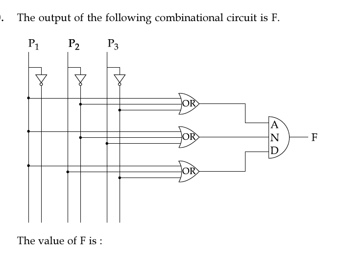

# Question 10

*UGC NET CS · 2017 Nov Paper 2 · Digital Logic Circuits and Components · Combinational Circuit Simplification*

The output of the following combinational circuit is F. The value of F is :

- **1.** P₁ + P₂′P₃
- **2.** P₁ + P₂′P₃′
- **3.** P₁ + P₂P₃′
- **4.** P₁′ + P₂P₃

> [!TIP]
> **Correct answer: 2. P₁ + P₂′P₃′**

## Solution

Reading the three OR gates from the rails gives (P₁+P₂′+P₃′), (P₁+P₂′+P₃), and (P₁+P₂+P₃′). The final AND gate multiplies these sums. The first two simplify by (X+Y)(X+Y′)=X with X=P₁+P₂′, leaving (P₁+P₂′)(P₁+P₂+P₃′). Using (A+B)(A+C)=A+BC gives P₁+P₂′(P₂+P₃′)=P₁+P₂′P₃′. Therefore option 2 is correct.

## Key Points

- Translate each gate into an expression first, then use Boolean identities such as (X+Y)(X+Y′)=X and absorption.

## Why the other options are incorrect

Options 1 and 3 drop the complement from one of the rails selected by the circuit. Option 4 complements P₁ even though every OR gate receives the uncomplemented P₁ rail. Carefully trace each connection dot before simplifying.

## Question Figure

