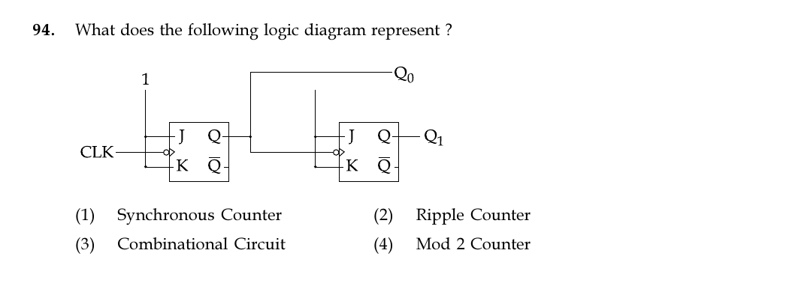

# Question 94

*UGC NET CS · 2018 July Paper 2 · Digital Logic Circuits and Components · Asynchronous Ripple Counters*

What does the following logic diagram represent ?

- **1.** Synchronous Counter
- **2.** Ripple Counter
- **3.** Combinational Circuit
- **4.** Mod 2 Counter

> [!TIP]
> **Correct answer: 2. Ripple Counter**

## Solution

Both JK flip-flops have J=K=1, so each toggles on its active clock edge. The first flip-flop is driven by the external CLK, but the second flip-flop's clock is driven by Q0 from the first. Because the clock transition propagates from one stage to the next instead of reaching all stages simultaneously, the circuit is an asynchronous ripple counter. Therefore option 2 is correct.

## Key Points

- If one flip-flop output clocks the next stage, transitions ripple through the chain: an asynchronous counter.

## Why the other options are incorrect

A synchronous counter gives every flip-flop the same clock. This sequential circuit contains storage, so it is not combinational. With two stages it cycles through four binary states (mod 4 under the usual connection), not merely mod 2.

## Question Figure

