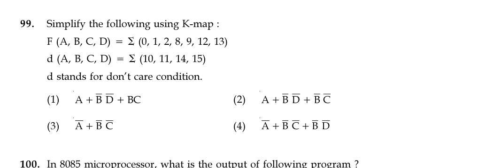

# Question 99

*UGC NET CS · 2018 July Paper 2 · Digital Logic Circuits and Components · Karnaugh Maps with Don't-Care Terms*

Use a K-map to simplify F(A,B,C,D)=Σm(0,1,2,8,9,12,13), with don't-cares d(A,B,C,D)=Σm(10,11,14,15).

- **1.** A + B̅D̅ + BC
- **2.** A + B̅D̅ + B̅C̅
- **3.** A̅ + B̅C̅
- **4.** A̅ + B̅C̅ + B̅D̅

> [!TIP]
> **Correct answer: 2. A + B̅D̅ + B̅C̅**

## Solution

Use the don't-cares to make the largest K-map groups. The eight cells with A=1 (minterms 8–15, where 10,11,14,15 are don't-cares) form an octet giving term A. Cells {0,2,8,10} form a quartet with B=0,D=0, giving B̅D̅. Cells {0,1,8,9} form a quartet with B=0,C=0, giving B̅C̅. Thus F=A+B̅D̅+B̅C̅, option 2.

## Key Points

- Treat don't-cares flexibly to form power-of-two groups; each larger group removes more variables.

## Why the other options are incorrect

Option 1 uses BC, which would assert minterms such as 3 or 7 that are zero. Options 3 and 4 use A̅ instead of the required A and therefore fail to cover the large A=1 group correctly. Don't-cares may be used as 1s when they enlarge a group but need not be covered.

## Question Figure

