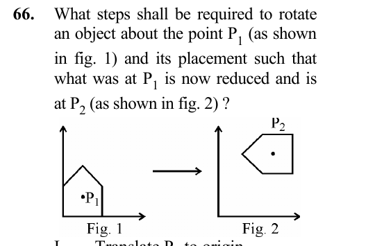

# Question 66

*UGC NET CS · 2013 Dec Paper 3 · 2-D Geometrical Transforms and Viewing · Composite Transformation about an Arbitrary Point*

What steps shall be required to rotate an object about the point P1 (as shown in fig. 1) and its placement such that what was at P 1 is now reduced and is at P2 (as shown in fig. 2) ? I. Translate P 1 to origin II. Scale as required III. Rotate IV. Translate to the final position P 2.

- **A.** I, II and III
- **B.** II, III and IV
- **C.** I, III & IV
- **D.** All of the above

> [!TIP]
> **Correct answer: D. All of the above**

## Solution

A transformation about an arbitrary pivot begins by translating the pivot P1 to the origin (I). With the pivot fixed at the origin, scale the object to the reduced size (II) and rotate it to the desired orientation (III). Finally translate the origin/pivot to its required final location P2 (IV). Omitting either translation would apply the rotation/scale about the wrong point or leave the object in the wrong place, so all four operations are required.

## Key Points

- Arbitrary-pivot composite transform: translate pivot to origin, transform, then translate to the destination.

## Why the other options are incorrect

A never moves the transformed object from the origin to P2. B performs scale/rotation before bringing P1 to the origin, so the transformation uses the wrong pivot. C omits the required reduction/scaling. Only D contains the complete sequence.

## Question Figure

