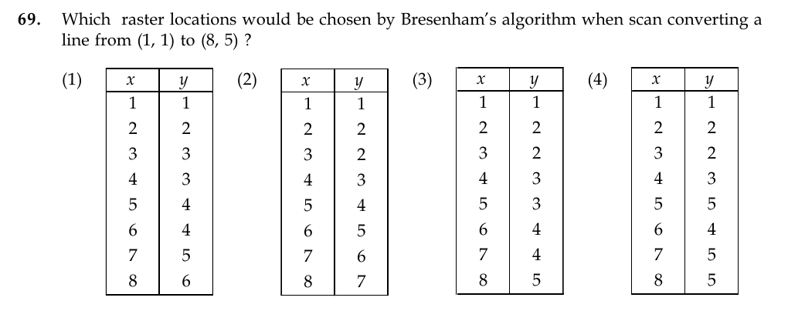

# Question 69

*UGC NET CS · 2015 Dec Paper 3 · Computer Graphics · Bresenham Line Algorithm*

Which raster locations are chosen by Bresenham's algorithm when scan-converting the line from (1,1) to (8,5)?

- **1.** (1,1),(2,2),(3,3),(4,3),(5,4),(6,4),(7,5),(8,6)
- **2.** (1,1),(2,2),(3,2),(4,3),(5,4),(6,5),(7,6),(8,7)
- **3.** (1,1),(2,2),(3,2),(4,3),(5,3),(6,4),(7,4),(8,5)
- **4.** (1,1),(2,2),(3,2),(4,3),(5,5),(6,4),(7,5),(8,5)

> [!TIP]
> **Correct answer: 3. (1,1),(2,2),(3,2),(4,3),(5,3),(6,4),(7,4),(8,5)**

## Solution

Here Δx=8−1=7 and Δy=5−1=4, so the initial Bresenham decision value is p₀=2Δy−Δx=1. Starting at (1,1), update x by one each step; choose the north-east pixel when p≥0 and the east pixel when p<0. The selected pixels are (1,1),(2,2),(3,2),(4,3),(5,3),(6,4),(7,4),(8,5), exactly option 3.

## Key Points

- For 0<m<1, Bresenham increments x every step and uses an integer decision variable to decide whether y also increments.

## Why the other options are incorrect

Options 1 and 2 rise too quickly and end above the required endpoint (8,5). Option 4 contains the abrupt point (5,5) and is not a monotone nearest-pixel trace of the line. A correct sequence must include both endpoints and distribute four y-increments across seven x-steps.

## Question Figure

