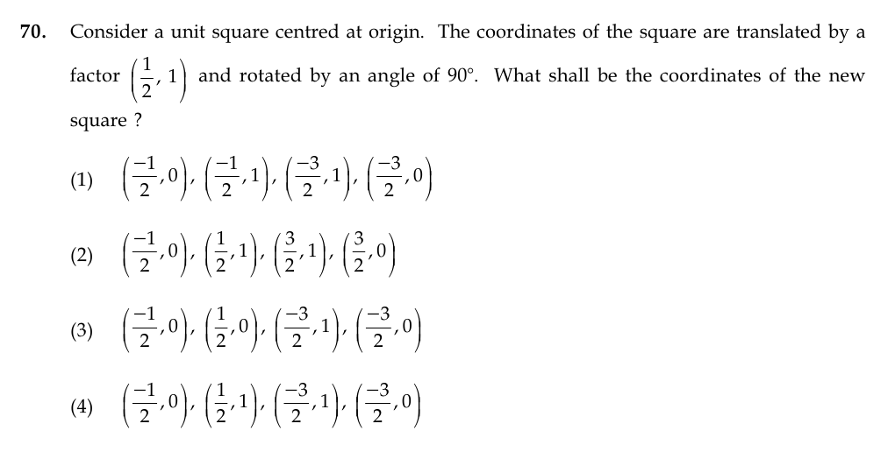

# Question 70

*UGC NET CS · 2015 Dec Paper 3 · 2-D Geometrical Transforms and Viewing · Composition of Translation and Rotation*

A unit square centered at the origin is first translated by (1/2,1) and then rotated counterclockwise through 90° about the origin. What are the coordinates of the transformed square?

- **1.** (−1/2,0),(−1/2,1),(−3/2,1),(−3/2,0)
- **2.** (−1/2,0),(1/2,1),(3/2,1),(3/2,0)
- **3.** (−1/2,0),(1/2,0),(−3/2,1),(−3/2,0)
- **4.** (−1/2,0),(1/2,1),(−3/2,1),(−3/2,0)

> [!TIP]
> **Correct answer: 1. (−1/2,0),(−1/2,1),(−3/2,1),(−3/2,0)**

## Solution

The centered unit square has vertices (−1/2,−1/2),(−1/2,1/2),(1/2,1/2),(1/2,−1/2). Translating by (1/2,1) gives (0,1/2),(0,3/2),(1,3/2),(1,1/2). A 90° counterclockwise rotation maps (x,y) to (−y,x), producing (−1/2,0),(−3/2,0),(−3/2,1),(−1/2,1). As an unordered vertex set, this is option 1.

## Key Points

- Composite transforms are order-sensitive: apply them to each vertex in the stated sequence.

## Why the other options are incorrect

The other choices mix signs or coordinates and do not equal the four points obtained by applying the same rotation to every translated vertex; several do not even form a unit square. The order matters: translation followed by rotation uses R(T(v)), not T(R(v)).

## Question Figure

