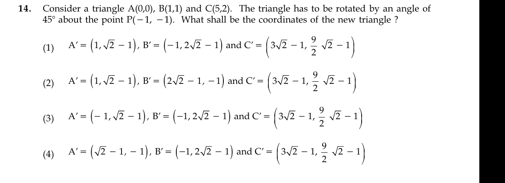

# Question 14

*UGC NET CS · 2015 June Paper 3 · 2-D Geometrical Transforms and Viewing · Rotation about an arbitrary point*

Consider triangle A(0,0), B(1,1), and C(5,2). It is rotated counterclockwise by 45° about P(-1,-1). What are the coordinates of the new triangle?

- **1.** A'=(1, √2−1), B'=(-1, 2√2−1), C'=(3√2−1, 9√2/2−1)
- **2.** A'=(1, √2−1), B'=(2√2−1, -1), C'=(3√2−1, 9√2/2−1)
- **3.** A'=(-1, √2−1), B'=(-1, 2√2−1), C'=(3√2−1, 9√2/2−1)
- **4.** A'=(√2−1, -1), B'=(-1, 2√2−1), C'=(3√2−1, 9√2/2−1)

> [!TIP]
> **Correct answer: No option is fully correct. Option 3 is evidently intended, but its C' x-coordinate is wrong in every option. The correct triangle is A'=(-1, √2−1), B'=(-1, 2√2−1), C'=(3√2/2−1, 9√2/2−1).**

## Solution

Rotate a point `(x,y)` about `P=(-1,-1)` by first translating to `(x+1,y+1)`, applying the 45° counterclockwise rotation `((u-v)/√2, (u+v)/√2)`, and translating back. A gives `(1,1) → (0,√2) → (-1,√2−1)`. B gives `(2,2) → (0,2√2) → (-1,2√2−1)`. C gives `(6,3) → (3/√2,9/√2) → (3√2/2−1,9√2/2−1)`. Option 3 has the correct A' and B' but, like all choices, prints `3√2−1` instead of `3√2/2−1` for C'_x.

## Key Points

- Rotation about P: translate by −P, rotate, translate by +P; do not rotate the absolute coordinates directly.

## Why the other options are incorrect

Options 1, 2, and 4 already fail for A' or B'. Option 3 matches those two points but still fails for C'. Because the erroneous C' coordinate is repeated in all four choices, selecting an option without stating this defect would teach an incorrect rotation.

## Question Figure

