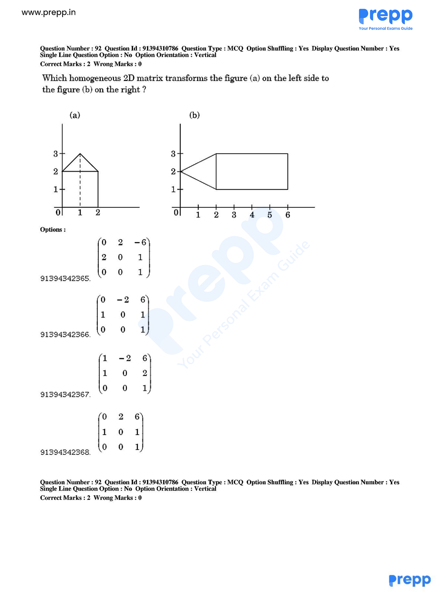

# Question 92

*UGC NET CS · 2018 Dec Paper 1 And 2 · 2-D Geometrical Transforms and Viewing · Homogeneous Transformation Matrices*

Which homogeneous 2D matrix transforms figure (a) into figure (b), as shown?

- **1.** [[0,2,-6],[2,0,1],[0,0,1]]
- **2.** [[0,-2,6],[1,0,1],[0,0,1]]
- **3.** [[1,-2,6],[1,0,2],[0,0,1]]
- **4.** [[0,2,6],[1,0,1],[0,0,1]]

> [!TIP]
> **Correct answer: 2. [[0,-2,6],[1,0,1],[0,0,1]]**

## Solution

From figure (a) to (b), test option 2: x′=−2y+6 and y′=x+1. The rectangle corners map as (0,0)→(6,1), (2,0)→(6,3), (0,2)→(2,1), and (2,2)→(2,3), exactly the horizontal rectangle in (b). The roof apex (1,3) maps to (0,2), exactly the left-pointing tip. Therefore the homogeneous matrix [[0,−2,6],[1,0,1],[0,0,1]] is correct, option 2.

## Key Points

- Validate a candidate homogeneous transform by mapping labelled vertices; column-vector form gives x′ and y′ directly from the first two rows.

## Why the other options are incorrect

The other matrices send one or more easy checkpoint vertices to the wrong quadrant, scale, or translation. Checking three noncollinear source points is sufficient to distinguish a 2D affine transform.

## Question Figure

