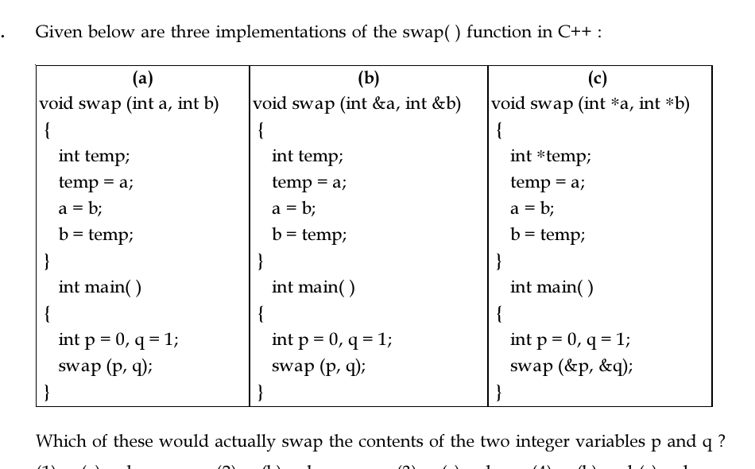

# Question 5

*UGC NET CS · 2018 July Paper 2 · Programming in C++ · Pass by Value, Reference and Pointer*

Which of the three shown C++ `swap` implementations would actually swap the contents of integer variables p and q?

- **1.** (a) only
- **2.** (b) only
- **3.** (c) only
- **4.** (b) and (c) only

> [!TIP]
> **Correct answer: 2. (b) only**

## Solution

Implementation (a) swaps only local integer copies because its parameters are passed by value. Implementation (b) binds `a` and `b` as references to p and q, so assigning through them changes the caller's variables and performs the swap. Implementation (c) receives pointer values, but its code merely swaps the local pointer parameters; it never assigns `*a` or `*b`, so p and q remain unchanged. Therefore only (b) works, giving option 2.

## Key Points

- To change caller data, use references or dereference pointers; rearranging local pointer copies does not rearrange pointed-to values.

## Why the other options are incorrect

Option 1 selects pass-by-value code. Option 3 mistakes swapping pointer variables for swapping the integers they point to. Option 4 would be correct only if (c) used an integer temporary and dereferenced the pointers, for example `temp=*a; *a=*b; *b=temp;`.

## Question Figure

