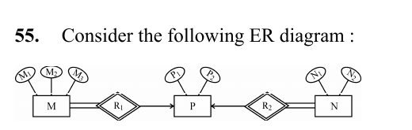

# Question 55

*UGC NET CS · 2013 Dec Paper 3 · Entity-Relationship Model · Mapping Relationships to Tables*

Consider the following ER diagram : The minimum number of tables required to represent M, N, P, R 1, R2 is

- **A.** 2
- **B.** 3
- **C.** 4
- **D.** 5

> [!TIP]
> **Correct answer: B. 3**

## Solution

The diagram has three entity types: M, P and N, so begin with three tables. R1 links M to P and R2 links N to P; each has an arrow toward P, indicating a many-to-one key constraint, and neither relationship has its own attributes. Each relationship can therefore be represented by storing P's key as a foreign key in the corresponding M or N table. The total-participation double lines do not require separate relationship tables. Minimum table count: 3.

## Key Points

- An attribute-free many-to-one relationship can usually be absorbed into the many-side table as a foreign key.

## Why the other options are incorrect

Two tables cannot represent all three entity sets. Four or five tables result from creating separate tables for R1 and/or R2, but those tables are unnecessary for attribute-free many-to-one relationships because foreign keys capture them without loss.

## Question Figure

