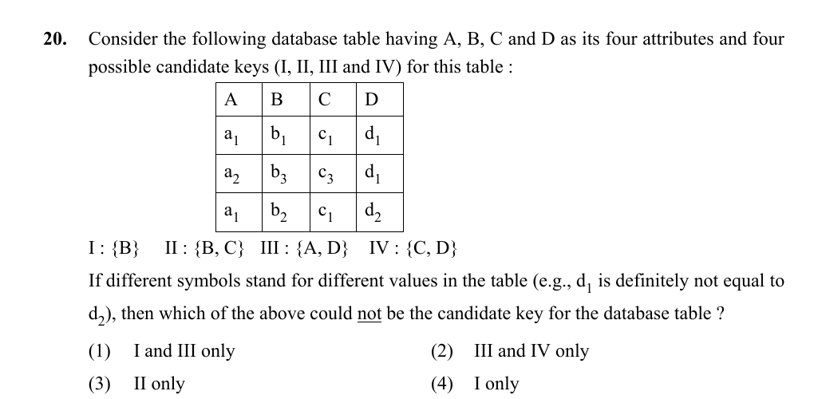

# Question 20

*UGC NET CS · 2016 July Paper 2 · Data Modeling · Candidate-Key Uniqueness and Minimality*

For the displayed instance of R(A,B,C,D), the proposed candidate keys are I={B}, II={B,C}, III={A,D}, and IV={C,D}. Different subscripted symbols denote different values. Which proposal could not be a candidate key?

- **1.** I and III only
- **2.** III and IV only
- **3.** II only
- **4.** I only

> [!TIP]
> **Correct answer: 3. II only**

## Solution

A candidate key must be both unique and minimal. B has values b₁,b₃,b₂, so {B} is unique and minimal. Therefore {B,C} is a superkey but cannot be a candidate key: removing C still leaves the key {B}, so it fails minimality. The pairs {A,D} and {C,D} are unique in the shown instance, while neither component alone is unique, so each could be minimal. Thus proposal II alone could not be a candidate key.

## Key Points

- Candidate key = minimal superkey.
- Uniqueness without minimality is not enough.

## Why the other options are incorrect

Options claiming I, III, or IV cannot be keys overlook their uniqueness/minimality in the table. The trap is assuming every unique attribute set is a candidate key; adding any attribute to an already unique key creates a nonminimal superkey.

## Question Figure

