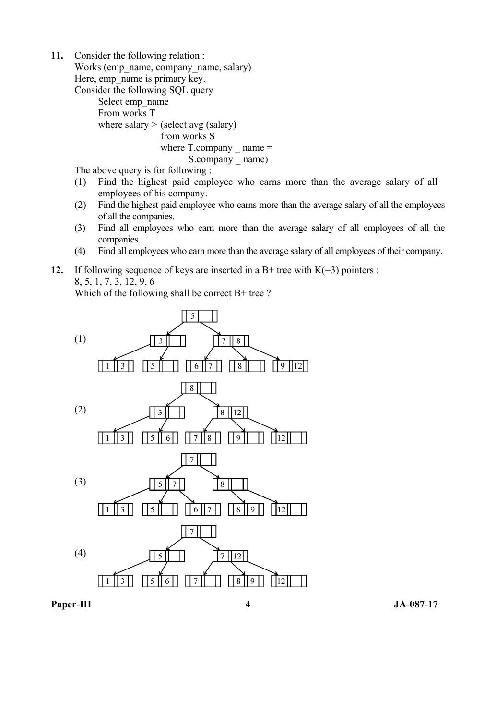

# Question 12

*UGC NET CS · 2017 Jan Paper 3 · File Organization and Indexing · B+ Tree Insertion and Node Splitting*

Keys 8, 5, 1, 7, 3, 12, 9 and 6 are inserted into a B+ tree with K=3 pointers. Which resulting B+ tree is correct?

- **1.** Tree shown as Option 1
- **2.** Tree shown as Option 2
- **3.** Tree shown as Option 3
- **4.** Tree shown as Option 4

> [!TIP]
> **Correct answer: 1. Tree shown as Option 1**

## Solution

With K=3, an internal node has at most three child pointers and two separator keys, and the paper's diagrams use the high-key convention: each separator is the largest key in the child immediately to its left. Insert 8,5,1: the overflowing leaf splits into [1,5] and [8], with root key 5. After 7 and 3, the leaves become [1,3], [5], [7,8] and the root has separators 3,5. Inserting 12 splits [7,8,12] and forces the root to split, producing root 5 with two internal children. Inserting 9 makes the last leaf [9,12]; inserting 6 splits [6,7,8] into [6,7] and [8]. The final leaves are [1,3], [5], [6,7], [8], [9,12], with internal separators [3] and [7,8] under root [5]. This is Option 1.

## Key Points

- In B+ tree questions, identify both the order and the separator convention before simulating leaf and internal-node splits.

## Why the other options are incorrect

The other diagrams do not match the stated high-key separator and split convention after the cascading split. A different textbook convention may copy the smallest key of the right child upward and draw another valid-looking shape, but among the paper's own diagrams and representation, Option 1 is the consistent result.

## Question Figure

