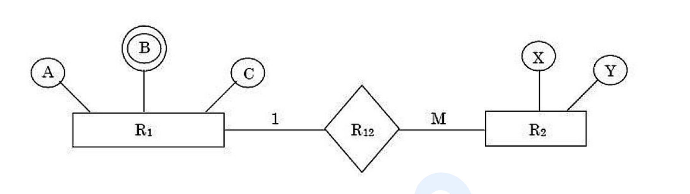

# Question 73

*UGC NET CS · 2019 Dec Paper 1 And 2 · Entity-Relationship Model · Mapping Multivalued Attributes and 1-to-M Relationships*

Find the minimum number of tables required to convert this E-R diagram into a relational database: entity R1 has simple attributes A and C and multivalued attribute B; entity R2 has attributes X and Y; R1 and R2 participate in a 1:M relationship R12 with no relationship attributes.

- **1.** 2
- **2.** 4
- **3.** 3
- **4.** 5

> [!TIP]
> **Correct answer: 3. 3**

## Solution

Create one table for entity R1 and one for entity R2. The multivalued attribute B cannot be stored as a repeating column in R1, so it requires a separate table containing R1's key together with one B value per row. The 1:M relationship R12 has no attributes, so it needs no separate table; place R1's key as a foreign key on the many side, R2. The minimum is therefore 3 tables, option 3.

## Key Points

- Each strong entity becomes a table; each multivalued attribute gets another table; an attribute-free 1:M relationship is represented by a foreign key on the M side.

## Why the other options are incorrect

Two tables would incorrectly keep multivalued B inside R1. Four would unnecessarily create a separate table for the attribute-free 1:M relationship. Five adds still more tables not required by any entity, multivalued attribute, or relationship attribute.

## Question Figure

