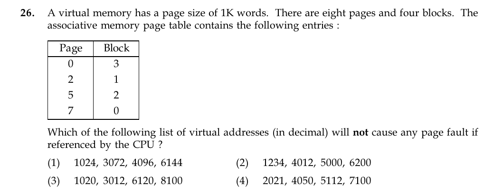

# Question 26

*UGC NET CS · 2015 Dec Paper 2 · Memory Management · Paging and Page Tables*

A virtual memory has a page size of 1K words, eight pages, and four blocks. The resident page-to-block mappings are 0→3, 2→1, 5→2, and 7→0. Which list of decimal virtual addresses causes no page fault?

- **1.** 1024, 3072, 4096, 6144
- **2.** 1234, 4012, 5000, 6200
- **3.** 1020, 3012, 6120, 8100
- **4.** 2021, 4050, 5112, 7100

> [!TIP]
> **Correct answer: 3. 1020, 3012, 6120, 8100**

## Solution

With a page size of 1K=1024 words, virtual page number is floor(address/1024). The resident pages are {0,2,5,7}. Option 3 maps as follows: 1020→page 0, 3012→page 2, 6120→page 5, and 8100→page 7. Every page is present in the associative page table, so none of these references faults.

## Key Points

- Page number = floor(virtual address/page size); a fault occurs when that page is absent from the page table.

## Why the other options are incorrect

Option 1 immediately references pages 1,3,4,6. Option 2 also maps to nonresident pages 1,3,4,6. Option 4 starts with pages 1 and 3 before reaching resident pages, so it causes faults.

## Question Figure

