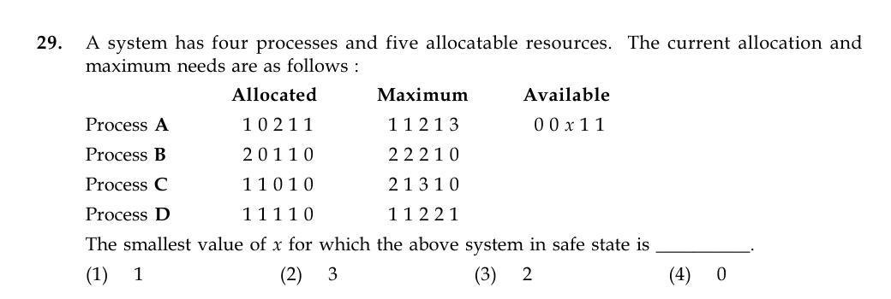

# Question 29

*UGC NET CS · 2015 Dec Paper 2 · Deadlocks · Banker's Safety Algorithm*

A system has five resource types. Allocated vectors are A=(1,0,2,1,1), B=(2,0,1,1,0), C=(1,1,0,1,0), D=(1,1,1,1,0); maximum vectors are A=(1,1,2,1,3), B=(2,2,2,1,0), C=(2,1,3,1,0), D=(1,1,2,2,1); and Available=(0,0,x,1,1). Find the smallest x that makes the state safe.

- **1.** 1
- **2.** 3
- **3.** 2
- **4.** 0

> [!TIP]
> **Correct answer: No listed value — the printed state is unsafe for every x**

## Solution

Need=Maximum−Allocated gives A=(0,1,0,0,2), B=(0,2,1,0,0), C=(1,0,3,0,0), and D=(0,0,1,1,1). The available fifth-resource count is only 1. Process A still needs 2 units of that resource, and B, C, and D hold zero units of it, so completing any of them can never increase the fifth component. Consequently A can never finish, regardless of x, and no complete safe sequence exists.

## Key Points

- Before running every safety sequence, check resource totals: if a process's remaining need can never become available, the state cannot be safe.

## Why the other options are incorrect

Changing x changes only the third resource. It cannot repair the permanent one-unit shortage of the fifth resource for A. Therefore 0, 1, 2, and 3 all fail the Banker's safety test on the table exactly as printed.

## Question Figure

