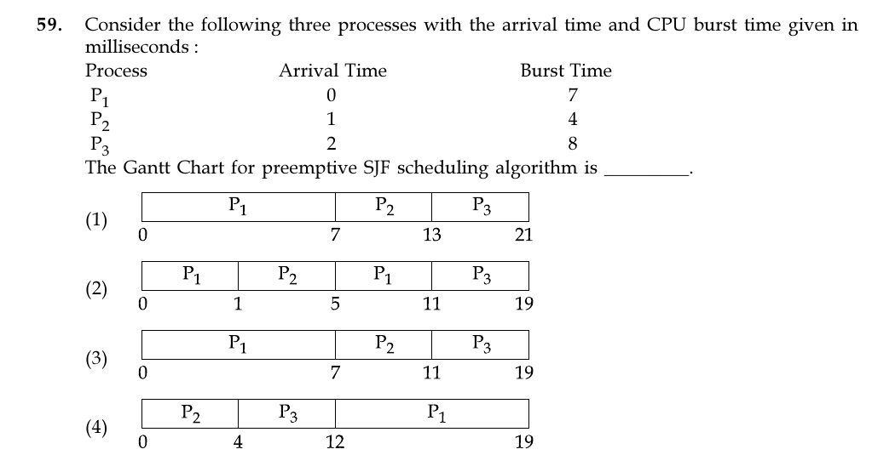

# Question 59

*UGC NET CS · 2018 July Paper 2 · CPU Scheduling · Shortest-Remaining-Time-First Scheduling*

Three processes have (arrival time, CPU burst time) P1=(0,7), P2=(1,4), P3=(2,8), in milliseconds. Which Gantt chart is produced by preemptive SJF?

- **1.** P1:0-7, P2:7-13, P3:13-21
- **2.** P1:0-1, P2:1-5, P1:5-11, P3:11-19
- **3.** P1:0-7, P2:7-11, P3:11-19
- **4.** P2:0-4, P3:4-12, P1:12-19

> [!TIP]
> **Correct answer: 2. P1:0-1, P2:1-5, P1:5-11, P3:11-19**

## Solution

Preemptive SJF is shortest-remaining-time-first. At t=0 only P1 is ready, so it runs. At t=1 P2 arrives with burst 4 while P1 has 6 ms remaining, so P2 preempts P1. At t=2 P3 arrives with 8 ms, but P2 has only 3 ms left, so P2 continues through t=5. Then P1's remaining 6 ms is shorter than P3's 8 ms, so P1 runs from 5 to 11 and P3 from 11 to 19. This is option 2.

## Key Points

- At every arrival or completion, SRTF chooses the ready process with the smallest remaining CPU time.

## Why the other options are incorrect

Option 1 even gives P2 a six-millisecond interval despite its four-millisecond burst. Option 3 is the non-preemptive SJF order because P1 is allowed to finish. Option 4 starts P2 before it arrives at t=1, making it impossible.

## Question Figure

