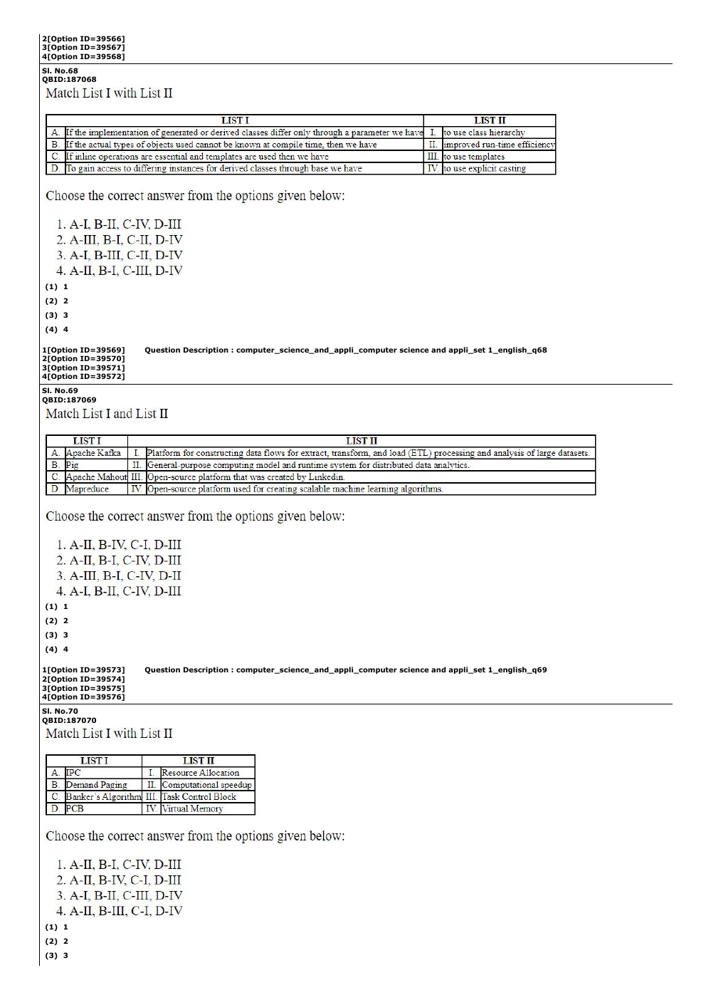

# Question 120

*UGC NET CS · 2023 Mar 11 Shift 2 Dec 2022 Session · Memory Management · Demand Paging*

Match List I with List II. List I: A. IPC; B. Demand Paging; C. Banker's Algorithm; D. PCB. List II: I. Resource Allocation; II. Computational speedup; III. Task Control Block; IV. Virtual Memory. Choose the correct answer.

- **1.** A-II, B-I, C-IV, D-III
- **2.** A-II, B-IV, C-I, D-III
- **3.** A-I, B-II, C-III, D-IV
- **4.** A-II, B-III, C-I, D-IV

> [!TIP]
> **Correct answer: 2. A-II, B-IV, C-I, D-III**

## Solution

IPC enables cooperation/computational speedup (A–II); demand paging implements virtual memory (B–IV); Banker's algorithm handles safe resource allocation (C–I); PCB is the task/process control block (D–III).

## Key Points

- Banker→allocation; demand paging→virtual memory; PCB→process metadata; IPC→cooperation.

## Why the other options are incorrect

Other choices confuse virtual memory with allocation or swap IPC and PCB roles.

## Question Figure

