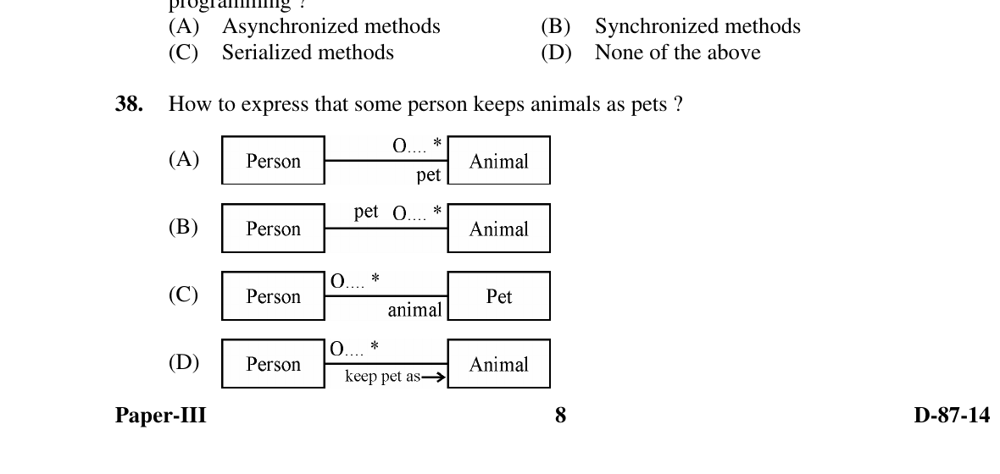

# Question 38

*UGC NET CS · 2014 Dec Paper 3 · Software Design · UML Association Roles and Multiplicity*

Which UML association diagram correctly expresses that some person keeps animals as pets?

- **A.** Diagram shown as Option A
- **B.** Diagram shown as Option B
- **C.** Diagram shown as Option C
- **D.** Diagram shown as Option D

> [!TIP]
> **Correct answer: A. Diagram shown as Option A**

## Solution

The domain classes should remain Person and Animal. A person may be associated with zero or more animals, so multiplicity 0..* belongs at the Animal end. The role name at that association end should be `pet`, indicating how an Animal participates from the Person's viewpoint. Option A places both the multiplicity and role at the correct end.

## Key Points

- In a UML association, an end's multiplicity says how many instances may occur there, and its role name describes the part that class plays in the relationship.

## Why the other options are incorrect

B places the role name `pet` at the Person end, reversing its meaning. C incorrectly models Pet as the class and labels the association end `animal`; being a pet is the Animal's role in this relationship. D uses a directional phrase as though it were the end-role notation and does not express the role as cleanly as A.

## Question Figure

