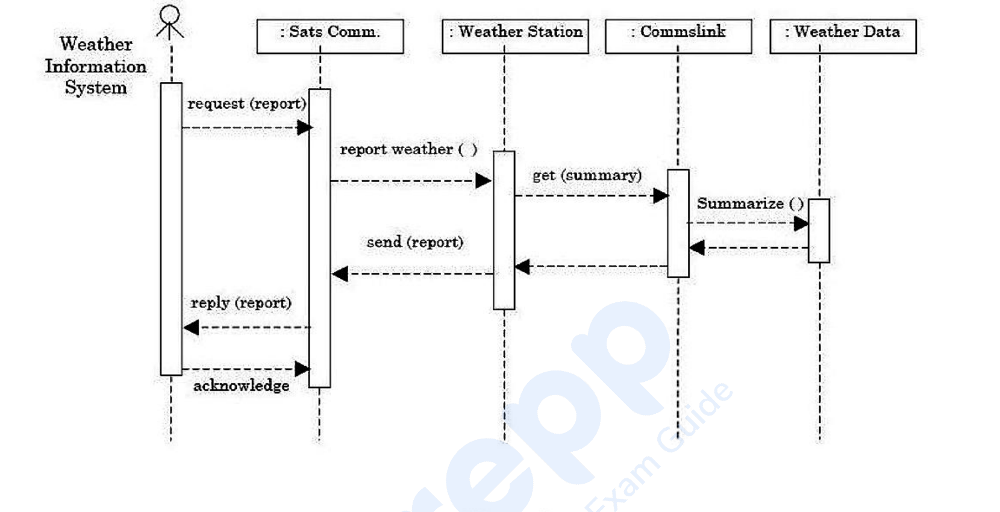

# Question 139

*UGC NET CS · 2019 Dec Paper 1 And 2 · Object-Oriented Analysis and Design · UML Sequence-Diagram Lifelines*

The sequence diagram in Figure 1 models a Weather Information System when an external system requests summarized data from a weather station. What is the increasing order of the activation lifetimes of the four system objects?

- **1.** Sat comms → Weather station → Commslink → Weather data
- **2.** Sat comms → Comms link → Weather station → Weather data
- **3.** Weather data → Comms link → Weather station → Sat Comms
- **4.** Weather data → Weather station → Comms link → Sat Comms

> [!TIP]
> **Correct answer: 3. Weather data → Comms link → Weather station → Sat Comms**

## Solution

Read the vertical activation rectangles, not merely the dashed object lifelines. Weather Data is active only while it performs summarize() and returns the result, so it has the shortest activation. Commslink remains active while it requests that summary and receives the response, making it longer. Weather Station is active across the larger get-summary interaction and the return of the report, so it is longer still. Sat Comms spans the entire report request and response exchange before acknowledgement, giving the longest activation among the four objects. The increasing order is therefore Weather Data → Commslink → Weather Station → Sat Comms, option 3.

## Key Points

- In a sequence diagram, a nested callee's activation is shorter than the caller activation that surrounds the call-and-return interval.

## Why the other options are incorrect

Options 1 and 2 list roughly decreasing rather than increasing activation duration. Option 4 incorrectly places Weather Station before Commslink even though the station's activation encloses the Commslink interaction and is therefore longer.

## Question Figure

