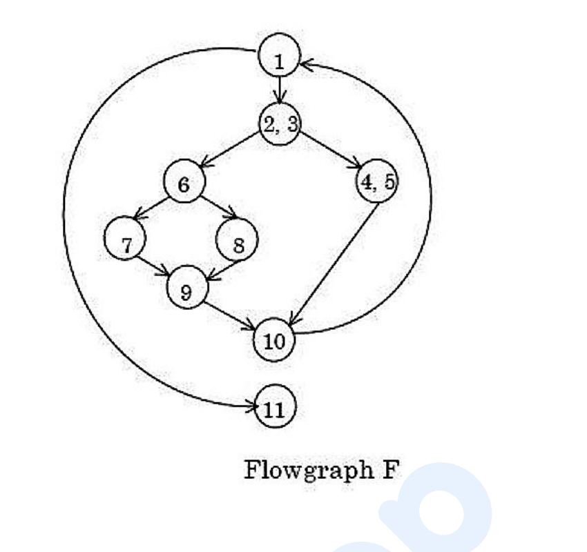

# Question 141

*UGC NET CS · 2019 Dec Paper 1 And 2 · Software Testing · Flow Graphs and Basis-Path Testing*

How many nodes are there in flowgraph F?

- **1.** 9
- **2.** 10
- **3.** 11
- **4.** 12

> [!TIP]
> **Correct answer: 1. 9**

## Solution

Count the circles in the flowgraph rather than the individual statement labels written inside them. The graphical nodes are 1, (2,3), 6, 7, 8, 9, (4,5), 10, and 11. The pairs (2,3) and (4,5) are each straight-line basic blocks drawn as one node, so neither pair contributes two separate flowgraph nodes. The total is therefore 9, which is option 1.

## Key Points

- Count graphical basic-block circles, not the number of statement labels printed inside each circle.

## Why the other options are incorrect

Ten, eleven, and twelve result from counting one or both labels inside a combined basic-block node separately or from confusing edges with nodes. A flowgraph node represents a maximal straight-line block and may contain several program statements.

## Question Figure

