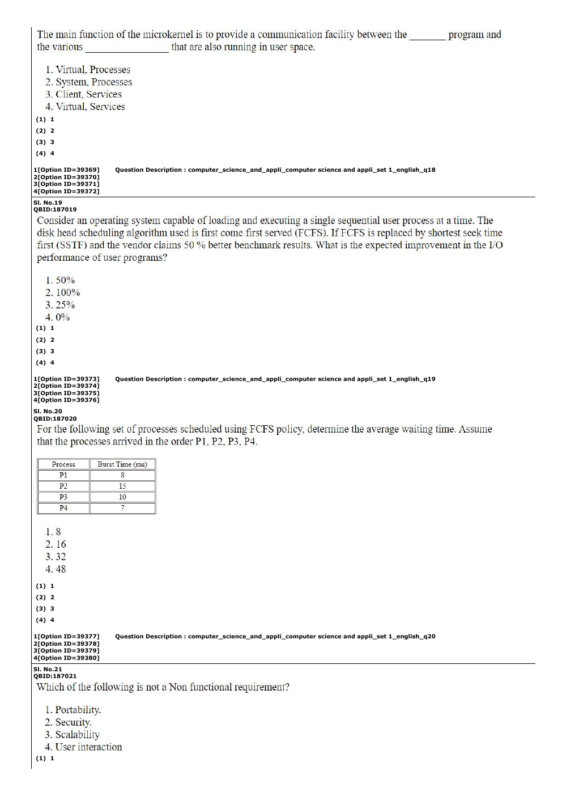

# Question 71

*UGC NET CS · 2023 Mar 11 Shift 2 Dec 2022 Session · Software Requirements · Functional and Non-Functional Requirements*

Which of the following is not a non-functional requirement?

- **1.** Portability
- **2.** Security
- **3.** Scalability
- **4.** User interaction

> [!TIP]
> **Correct answer: 4. User interaction**

## Solution

Portability, security, and scalability describe qualities or constraints on how well a system operates, so they are non-functional requirements. User interaction describes behavior the system must provide—how users interact with it—and is therefore a functional concern in this list.

## Key Points

- Functional requirements describe what the system does; non-functional requirements describe qualities or constraints on how it does it.

## Why the other options are incorrect

The first three options are standard quality attributes. They constrain implementation or operation rather than specifying a particular user-visible service.

## Question Figure

