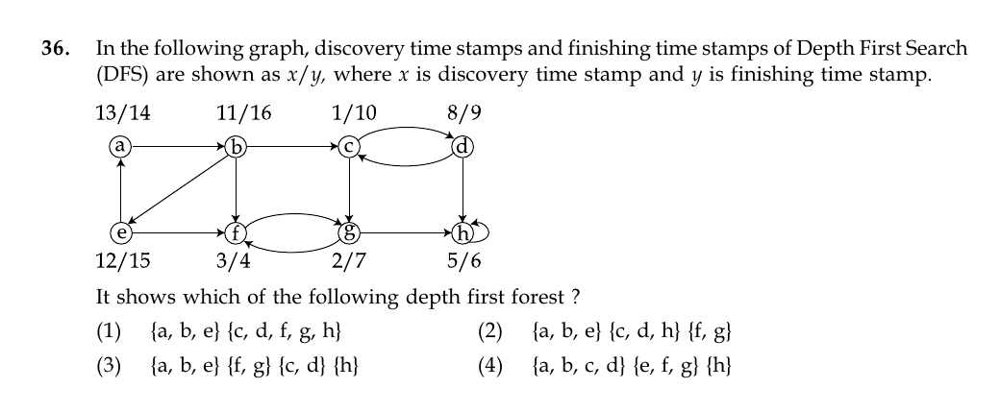

# Question 36

*UGC NET CS · 2015 Dec Paper 2 · Graph Algorithms · DFS Timestamps and Forests*

In the following graph, discovery time stamps and finishing time stamps of Depth First Search (DFS) are shown as x/y, where x is discovery time stamp and y is finishing time stamp. It shows which of the following depth first forest ?

- **1.** {a, b, e} {c, d, f, g, h}
- **2.** {a, b, e} {c, d, h} {f, g}
- **3.** {a, b, e} {f, g} {c, d} {h}
- **4.** {a, b, c, d} {e, f, g} {h}

> [!TIP]
> **Correct answer: 1. {a, b, e} {c, d, f, g, h}**

## Solution

DFS intervals in one tree are nested. The interval for c is [1,10]; it contains g=[2,7], f=[3,4], h=[5,6], and d=[8,9], so those five vertices form one DFS tree. The next root has interval b=[11,16], containing e=[12,15] and a=[13,14], so {a,b,e} forms the other tree. Therefore the forest is {a,b,e} and {c,d,f,g,h}.

## Key Points

- In DFS, descendants have intervals strictly nested inside their ancestor's discovery/finish interval.

## Why the other options are incorrect

Options 2 and 3 split vertices whose discovery/finish intervals are nested inside the same root interval. Option 4 groups intervals from the two disjoint top-level ranges [1,10] and [11,16].

## Question Figure

