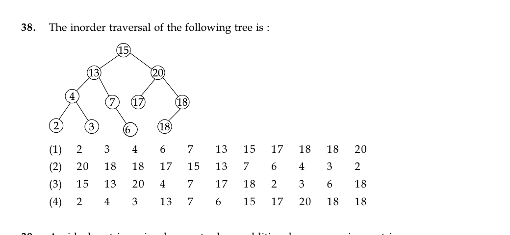

# Question 38

*UGC NET CS · 2015 Dec Paper 2 · Data Structures · Binary-Tree Inorder Traversal*

The inorder traversal of the following tree is :

- **1.** 2 3 4 6 7 13 15 17 18 18 20
- **2.** 20 18 18 17 15 13 7 6 4 3 2
- **3.** 15 13 20 4 7 17 18 2 3 6 18
- **4.** 2 4 3 13 7 6 15 17 20 18 18

> [!TIP]
> **Correct answer: 4. 2 4 3 13 7 6 15 17 20 18 18**

## Solution

Inorder traversal visits left subtree, node, then right subtree. For node 4 the order is 2,4,3; then visit 13, followed by node 7 and its right child 6. This gives the whole left side 2,4,3,13,7,6. Visit root 15. On the right, visit 17, then 20, then the upper 18's left child 18 and the upper 18 itself. The complete sequence is 2,4,3,13,7,6,15,17,20,18,18.

## Key Points

- Inorder is recursive L–Node–R; apply it independently at every node, even when labels are not in BST order.

## Why the other options are incorrect

Option 1 incorrectly orders both children of 4 and moves 13 after 7. Option 2 is essentially a reverse-style order. Option 3 starts at the root, which is characteristic of preorder rather than inorder.

## Question Figure

