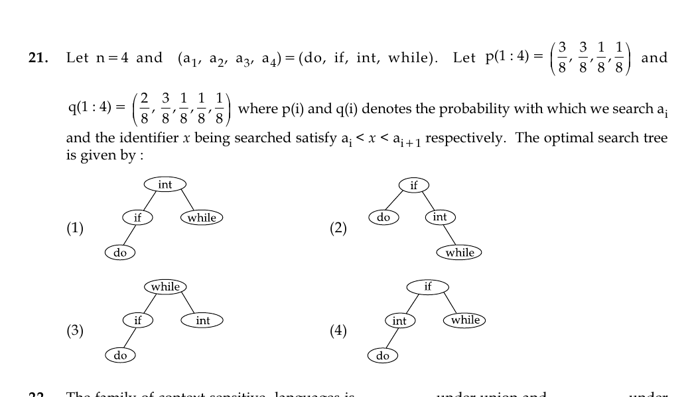

# Question 21

*UGC NET CS · 2015 Dec Paper 3 · Dynamic Programming · Optimal Binary Search Trees*

For ordered keys (do, if, int, while), successful-search weights are p=(3/8,3/8,1/8,1/8) and the five unsuccessful-gap weights are q=(2/8,3/8,1/8,1/8,1/8). Which displayed binary search tree is optimal?

- **1.** while
- **2.** int while (while
- **3.** int
- **4.** while

> [!TIP]
> **Correct answer: 2. int while (while**

## Solution

Apply the optimal-BST dynamic program to the ordered keys. For every interval [i,j], test each key r as root using cost(i,r−1)+cost(r+1,j)+the total successful and unsuccessful weight in [i,j]. The minimum for all four keys chooses `if` as root; its left subtree is the single key `do`, and the right interval chooses `int` with right child `while`. This is exactly tree 2.

## Key Points

- Optimal BST minimizes weighted successful and unsuccessful search depth while preserving sorted-key order.

## Why the other options are incorrect

Trees 1 and 3 preserve order but have larger weighted search cost because they place the two high-weight keys less effectively. Tree 4 violates binary-search ordering by placing `int`, which is greater than `if`, in `if`'s left subtree. The printed p and q lists each sum to one rather than jointly to one, but treating them as relative weights still yields tree 2.

## Question Figure

