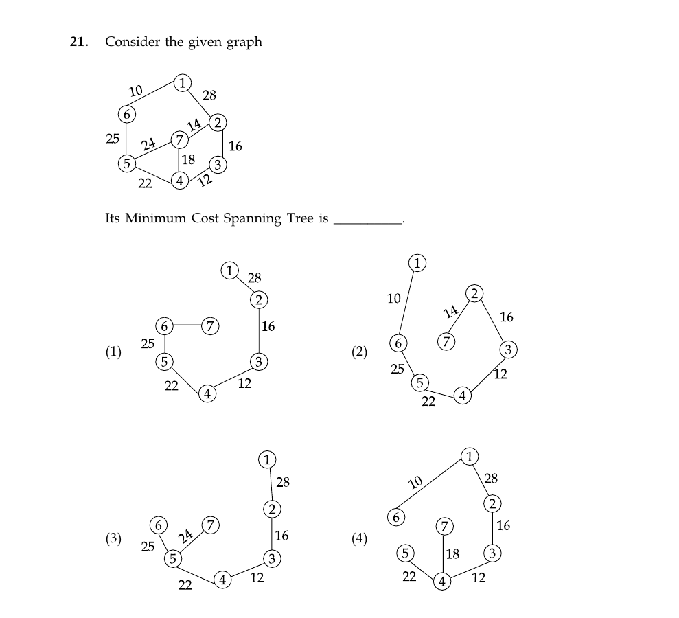

# Question 21

*UGC NET CS · 2015 June Paper 2 · Graph Algorithms · Minimum Spanning Trees*

Consider the weighted graph shown. Which of the four illustrated subgraphs is its minimum-cost spanning tree?

- **1.** Illustrated tree 1
- **2.** Illustrated tree 2
- **3.** Illustrated tree 3
- **4.** Illustrated tree 4

> [!TIP]
> **Correct answer: 2. Illustrated tree 2**

## Solution

Apply Kruskal's algorithm by considering edges in nondecreasing order. Select 1–6 (10), 3–4 (12), 2–7 (14), 2–3 (16), skip 7–4 (18) because it would close the cycle 7–2–3–4–7, select 4–5 (22), skip 5–7 (24) because it would form another cycle, and select 5–6 (25) to join the remaining two components. These six edges connect all seven vertices with total cost `10 + 12 + 14 + 16 + 22 + 25 = 99`, exactly the tree in option 2.

## Key Points

- Kruskal repeatedly takes the cheapest edge that joins two different components; for a seven-vertex MST, stop after six accepted edges.

## Why the other options are incorrect

Option 1 uses cost-28 edge 1–2 and does not show the required 2–7 edge of cost 14. Option 3 also uses 1–2 (28) and 5–7 (24), producing a larger tree. Option 4 includes 1–2 (28) and 7–4 (18) while omitting cheaper connections. Each is more expensive than cost 99.

## Question Figure

