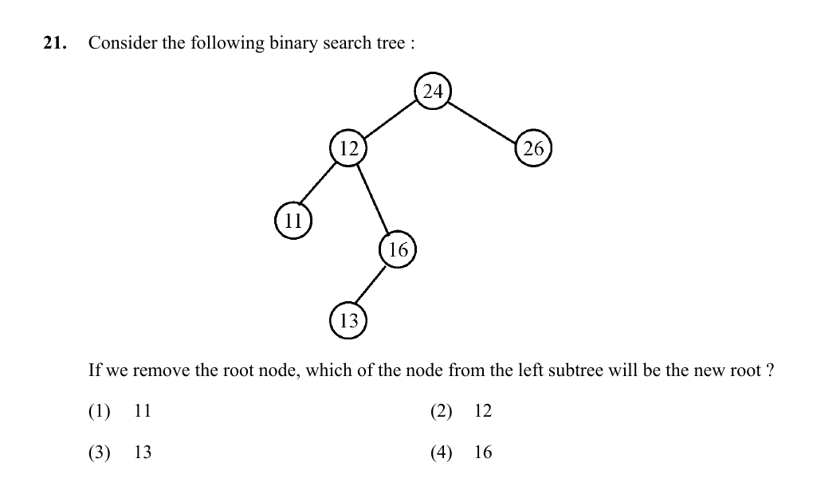

# Question 21

*UGC NET CS · 2016 July Paper 2 · Data Structures · Binary Search Tree Deletion*

In the displayed binary search tree, if the root is removed and replaced by a node from its left subtree, which node becomes the new root?

- **1.** 11
- **2.** 12
- **3.** 13
- **4.** 16

> [!TIP]
> **Correct answer: 4. 16**

## Solution

When deleting a BST node with two children and choosing a replacement from its left subtree, use the inorder predecessor: the largest key in that left subtree. Starting at 12, follow right links to 16; 16 has no right child, so it is the maximum left-subtree key and becomes the new root.

## Key Points

- BST deletion with two children: replace by inorder predecessor (max left) or successor (min right).

## Why the other options are incorrect

Nodes 11, 12, and 13 are smaller but are not the rightmost node of the left subtree. Replacing 24 with any of them without additional restructuring would leave a larger left-subtree key above the new root and violate the BST order.

## Question Figure

