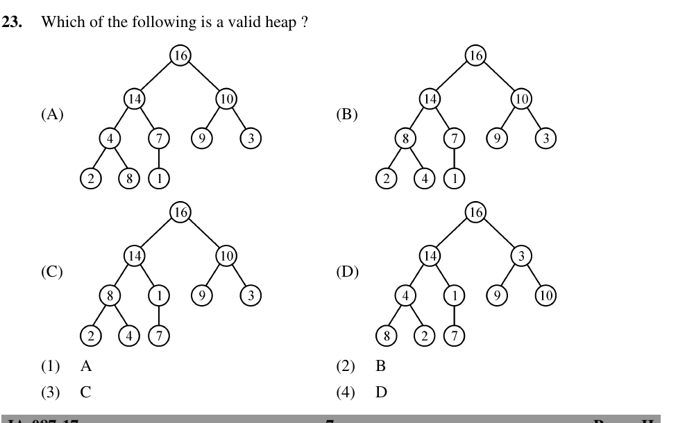

# Question 23

*UGC NET CS · 2017 Jan Paper 2 · Data Structures · Array Representation of a Binary Max-Heap*

Which of the four displayed trees is a valid heap?

- **1.** A
- **2.** B
- **3.** C
- **4.** D

> [!TIP]
> **Correct answer: 2. B**

## Solution

A valid binary max-heap must be a complete binary tree and every parent must be at least as large as each child. Tree B has root 16, then 14 and 10, and every lower comparison also satisfies the max-heap order: 14≥8,7; 10≥9,3; 8≥2,4; and 7≥1. Its last level is filled from left to right, so it is complete. Therefore B, option 2, is the valid heap.

## Key Points

- Heap validity requires both shape (complete tree) and order (parent dominates children); neither property alone is enough.

## Why the other options are incorrect

In A, node 4 has child 8, violating parent≥child. In C, node 1 has child 7. In D, node 3 has children 9 and 10 (and other lower violations also occur). Each fails the max-heap order even though the drawing resembles a tree.

## Question Figure

