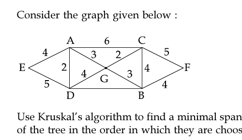

# Question 5

*UGC NET CS · 2017 Nov Paper 2 · Graph Algorithms · Minimum Spanning Trees*

Consider the graph given below : Use Kruskal’s algorithm to find a minimal spanning tree for the graph. The List of the edges of the tree in the order in which they are choosen is ?

- **1.** AD, AE, AG, GC, GB, BF
- **2.** GC, GB, BF, GA, AD, AE
- **3.** GC, AD, GB, GA, BF, AE
- **4.** AD, AG, GC, AE, GB, BF

> [!TIP]
> **Correct answer: 3. GC, AD, GB, GA, BF, AE**

## Solution

Kruskal's algorithm considers edges in nondecreasing weight and accepts an edge only if it joins two different components. The two weight-2 edges GC and AD are accepted. The weight-3 edges GB and GA are then accepted, joining B and the AD component to the GC component. Of the weight-4 edges, BF introduces F and AE introduces E, while DG and CB would form cycles. One valid tie order is therefore GC, AD, GB, GA, BF, AE—option 3. These six edges connect all seven vertices with total weight 18.

## Key Points

- Kruskal: sort by weight, use a disjoint-set view, and accept the next edge only when its endpoints are in different components.

## Why the other options are incorrect

Option 1 chooses weight-4 AE before available weight-2 and weight-3 edges, so it is not Kruskal order. Option 2 accepts BF before the remaining weight-3 edge GA. Option 4 similarly places AE too early. Equal-weight edges may swap order, but weights must never decrease and cycles must be rejected.

## Question Figure

