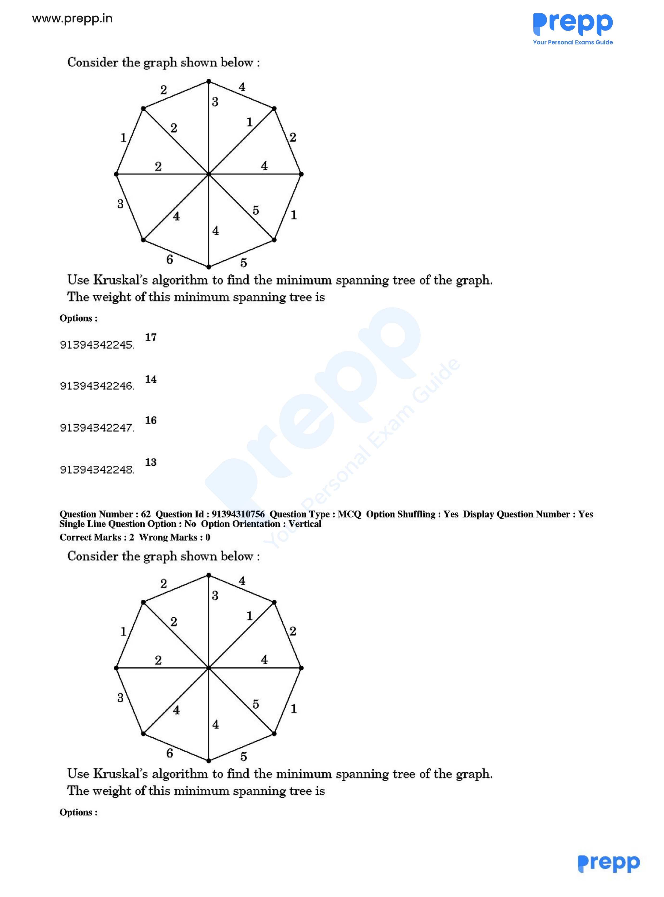

# Question 62

*UGC NET CS · 2018 Dec Paper 1 And 2 · Graph Algorithms · Minimum Spanning Trees*

Use Kruskal's algorithm on the graph shown in the accompanying figure. What is the weight of its minimum spanning tree?

- **1.** 17
- **2.** 14
- **3.** 16
- **4.** 13

> [!TIP]
> **Correct answer: 3. 16**

## Solution

Kruskal's algorithm sorts edges by nondecreasing weight and adds an edge only if it connects two different current components. For the pictured nine-vertex graph, the accepted edges comprise three edges of weight 1, three of weight 2, one of weight 3, and one of weight 4. Their total is 3×1+3×2+3+4=16. Eight accepted edges connect all nine vertices without a cycle, so option 3 is the minimum-spanning-tree weight.

## Key Points

- Kruskal: repeatedly take the lightest cycle-free edge until V−1 edges have been selected.

## Why the other options are incorrect

The other totals arise from either accepting a light edge that closes a cycle or choosing an unnecessarily heavy connecting edge. A spanning tree on nine vertices must have exactly eight edges; stopping earlier leaves the graph disconnected and adding a ninth creates a cycle.

## Question Figure

