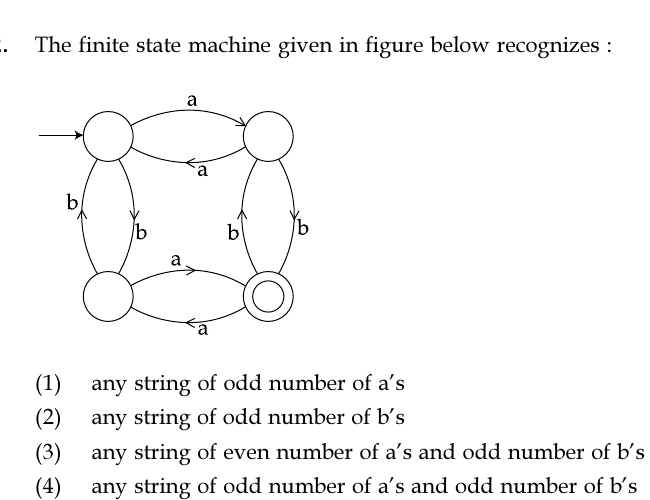

# Question 32

*UGC NET CS · 2018 July Paper 2 · Finite Automata · Product Automata for Symbol Parity*

The finite state machine given in figure below recognizes :

- **1.** any string of odd number of a’s
- **2.** any string of odd number of b’s
- **3.** any string of even number of a’s and odd number of b’s
- **4.** any string of odd number of a’s and odd number of b’s

> [!TIP]
> **Correct answer: 4. any string of odd number of a’s and odd number of b’s**

## Solution

Interpret the four states as parity pairs for counts of (a,b). The start at top-left is (even,even). Reading `a` moves horizontally and toggles a-parity; reading `b` moves vertically and toggles b-parity. The sole accepting state is bottom-right, reached exactly when both parities are odd. Thus the machine accepts strings with an odd number of a's and an odd number of b's, option 4.

## Key Points

- A four-state product automaton can track two independent parity bits; each symbol toggles only its own bit.

## Why the other options are incorrect

Options 1 and 2 ignore the parity tracked for the other symbol. Option 3 would require the bottom-left state (even a, odd b) to be accepting, but the diagram marks bottom-right instead.

## Question Figure

